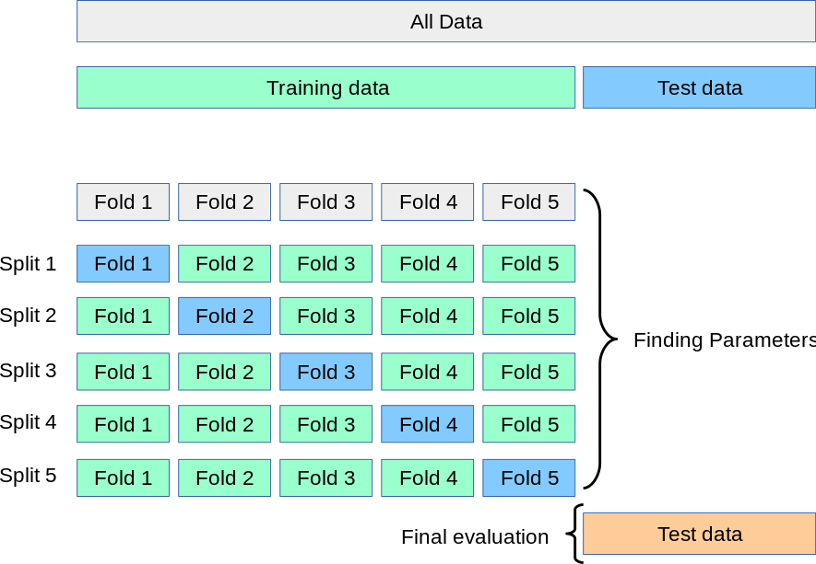
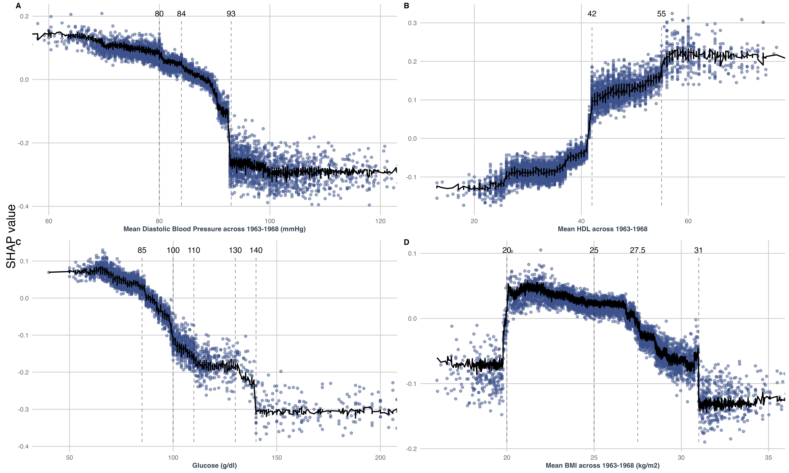

```{r}
#| include: false 

# Load required libraries
library(tidyverse)
library(tidymodels)
library(patchwork)
library(future)
library(furrr)
library(ggplot2)
library(glmnet)
library(gtsummary)
library(ggforce)
library(ggpubr) 
library(readr) 
library(plotly)
library(htmlwidgets)
library(RColorBrewer)
library(rpart)
library(rpart.plot)
library(kableExtra)
library(scam)
library(shapviz)
library(xml2)
# Source functions and load data
source("scripts/00 - funcs.R")
# ---------------------------------------------------------------------------- #
## Define Model-Specific Parameters and Functions -----------------------------
# ---------------------------------------------------------------------------- #
thresh_other <- 0.1 # Threshold for grouping infrequent levels to "other_combined"
thresh_corr <- 0.9 # Correlation threshold for removing highly correlated predictors

ctl_grid <- control_resamples(
  save_pred = TRUE,
  save_workflow = TRUE,
  parallel_over = 'everything'
)

```

```{r}
#| include: false 
# Load pre-prepared modeling dataset
load("data/model_fits.RData")
load("data/roc_data.RData")
load("data/shap.RData")
```

## Learning Objectives

By the end of this lecture, you will be able to:

::: incremental
-   **Distinguish** between machine learning and traditional epidemiological approaches
-   **Recognize** when ML is appropriate vs. traditional methods
-   **Understand** core ML concepts: the ML workflow, models, overfitting, cross-validation
-   **Implement** ML workflows using R and tidymodels
-   **Evaluate** model performance using appropriate metrics
-   **Apply** explainable AI tools to interpret complex models
:::

::: notes
This lecture bridges traditional epidemiological training with modern ML methods. We'll use the Centenarianism prediction study throughout as our practical example.
:::

## A roadmap for this lecture

-   This lecture is based on our published research: [Machine learning in epidemiology: An introduction, comparison with traditional methods, and a case study of predicting extreme longevity](https://doi.org/10.1016/j.annepidem.2025.07.024) - elaborated information can be found there

    -   Prospective cohort of **10,059 middle-aged Israeli men,** median entry age 49; **6.9% reached age ≥95.**

    -   R**ecruited in 1963**, with repeat assessments in 1965 and 1968

    -   Long-term follow-up to ensure capture of survival to advanced ages

    -   The target outcome is **near-centenarianism**, defined pragmatically as **survival to age 95 years or older** (rather than ≥100, due to rarity). 

    -   The **prediction task** is a supervised, individual-level **binary classification**: using **midlife predictors** spanning demographic, clinical, lifestyle/physical activity, occupational, family, and dietary factors (146 modeled variables) to predict who will reach **≥95 years**.

-   The data in this lecture was synthetically made with [synthpop](https://www.synthpop.org.uk) package in R based on the original dataset

-   The scripts and data for this lecture can be found in my [GitHub repository](https://github.com/doratiass/ml_for_epidemiology)

-   **StatQuest** [website](https://statquest.org) and [YouTube channel](https://www.youtube.com/@statquest) by **Josh Starmer** - great resource for learning ML concepts

# Why Machine Learning in Public Health?

## What is Machine Learning?

::: {style="text-align: center; margin-top: 2em;"}
> *"The field of study that gives computers the ability to learn without being explicitly programmed"*
>
> **— Arthur Samuel (1959)**
:::

::: notes
Start with the classic definition from Arthur Samuel, one of the pioneers of machine learning. This emphasizes that ML is about pattern recognition and learning from data, not just following pre-programmed rules.
:::

## Why ML in Healthcare Now?

::::: columns
::: {.column width="50%"}
### 📊 Data are bigger

**Exponential Growth:**

-   Electronic health records everywhere
-   Genomics becoming routine
-   Wearable devices widespread
-   High-resolution medical imaging

*We're drowning in data but starving for insights*

------------------------------------------------------------------------

### 🧩 Problems are messier

**New Complexities:**

-   Multiple chronic conditions per patient
-   Rare diseases being recorded
-   High dimensional data
-   Dynamic health trajectories

*Traditional methods hit their limits*
:::

::: {.column width="50%"}
### 🎯 Medicine is personalized

**Individual Focus:**

-   Risk assessment individualized
-   Dosing optimized per person
-   Genetic guided therapies
-   Tailored prevention strategies

*One-size-fits-all is obsolete*

------------------------------------------------------------------------

### 💻 Compute is accessible

**Infrastructure Ready:**

-   Cloud computing democratized
-   GPU processing power accessible
-   Open-source tools proliferated
-   Storage costs plummeted

*The computational barrier dissolved*
:::
:::::

::: notes
Emphasize that this isn't just about having better computers—it's about the convergence of multiple trends creating a unique opportunity for healthcare improvement.
:::

## 🧠 Machine Learning: The Perfect Bridge {.center}

::::::::: columns
::::: {.column width="50%"}
::: {style="background-color: #f8f9fa; padding: 1.5em; border-radius: 10px; margin: 1em 0;"}
**🗂️ Handles High-Dimensional Data** *Thousands of variables? No problem.*
:::

::: {style="background-color: #e8f5e8; padding: 1.5em; border-radius: 10px; margin: 1em 0;"}
**🔍 Discovers Hidden Patterns** *Finds relationships humans miss.*
:::
:::::

::::: {.column width="50%"}
::: {style="background-color: #f8f9fa; padding: 1.5em; border-radius: 10px; margin: 1em 0;"}
**⚙️ Automates Feature Learning** *Less manual engineering needed.*
:::

::: {style="background-color: #e8f5e8; padding: 1.5em; border-radius: 10px; margin: 1em 0;"}
**⚡ Scales with Data Growth** *More data = better performance.*
:::
:::::
:::::::::

::: callout-note
**Before:** We had either data OR computing power OR methods—never all three.

**Now:** Data explosion + cloud computing + ML algorithms = **Healthcare transformation**
:::

::: notes
This slide serves as a powerful transition from "why now" to "what ML can do." The bridge metaphor visually reinforces that ML connects our data-rich reality with actionable clinical solutions.
:::

## Prediction vs. Causation: Different Tools for Different Questions

::::: columns
::: {.column width="50%"}
### Traditional Epidemiological Methods

-   **Causal inference** focus: understanding mechanisms

-   Clear **parametric assumptions**

-   **Linear** relationships

-   Need for **Pre-specified interactions**

-   Relatively parsimonious models

-   **Interpretable** coefficients

> *"Does smoking **cause** cardiovascular disease?"*
:::

::: {.column width="50%"}
### Machine Learning Methods

-   Optimizing **predictions**

-   **Flexible model** assumptions

-   **Non-linear** relationships

-   Discover unknown patterns and **complex interactions**

-   **High-dimensional** datasets (Large p, p\>N)

-   Complex models: **"black box"** by nature

> *"**Who** will develop cardiovascular disease?"*
:::
:::::

::: callout-important
Machine learning can also be used for causal inference, but this is outside the scope of this lecture
:::

# Core Concepts of Machine Learning

## Machine Learning Workflow for Epidemiological Research

```{r}
#| fig-width: 12
#| fig-height: 8
#| fig-align: center

# Create workflow diagram
workflow_data <- tibble(
  step = 1:8,
  title = c(
    "Study Design &\nCohort Definition",
    "Exploratory Data\nAnalysis (EDA)",
    "Model Selection",
    "Data Splitting",
    "Data Preprocessing &\nFeature Engineering",
    "Model Training",
    "Model Evaluation",
    "Interpretation &\nValidation"
  ),
  short_desc = c(
    "Define research question,\nstudy population,\noutcome & predictors",
    "Explore distributions,\nvisualize relationships,\nidentify patterns",
    "Choose algorithms,\ncomplexity-interpretability-\nperformance trade-offs",
    "Split data (75% train/25% test)\nor by time to prevent leakage",
    "Clean data, handle missing,\nencode variables,\ncreate features",
    "Fit models, optimize parameters\nusing cross-validation\non training set",
    "Evaluate discrimination (ROC-AUC),\ncalibration, validation\non test set",
    "Analyze model, explainability\nmethods (SHAP, PDP),\nexternal validation"
  ),
  detailed_desc = c(
    # Step 1: Study Design
    "• Define specific research question and hypotheses\n• Establish inclusion/exclusion criteria for cohort\n• Identify primary and secondary outcomes\n• Select relevant predictors based on literature\n• Consider temporal relationships and causality\n• Plan for confounders and effect modifiers\n• Determine sample size requirements\n• Ethics approval and data governance",
    
    # Step 2: EDA
    "• Examine variable distributions and missing patterns\n• Create univariate and bivariate visualizations\n• Identify outliers and data quality issues\n• Explore correlations between variables\n• Assess outcome prevalence/incidence\n• Stratify analyses by key subgroups\n• Document data anomalies and assumptions\n• Generate descriptive statistics tables",
    
    # Step 3: Model Selection
    "• Consider interpretability requirements\n• Match algorithm to problem type (classification/regression)\n• Account for data size and dimensionality\n• Evaluate computational constraints\n• Consider domain expertise and clinical utility\n• Plan for model ensemble approaches\n• Assess regulatory/publication requirements\n• Document algorithm selection rationale",
        
    # Step 4: Data Splitting
    "• Random splits for cross-sectional data\n• Temporal splits for longitudinal studies\n• Site-based splits for multi-center studies\n• Stratify by outcome to maintain distribution\n• Create validation holdout set if needed\n• Document splitting strategy and seed\n• Ensure no patient overlap between sets\n• Consider cluster-based splitting for related observations",
    
    # Step 5: Preprocessing & Feature Engineering
    "• Handle missing data (imputation strategies)\n• Encode categorical variables appropriately\n• Scale/normalize continuous variables\n• Create interaction terms between risk factors\n• Engineer time-to-event variables\n• Derive clinical variables (BMI categories, etc.)\n• Apply transformations (log, square root)\n• Feature selection and dimensionality reduction\n⚠️ WARNING: Prevent data leakage to next steps",

    # Step 6: Model Training
    "• Implement nested cross-validation for hyperparameters\n• Use appropriate performance metrics\n• Monitor for convergence issues\n• Apply regularization techniques\n• Handle class imbalance if present\n• Save model artifacts and parameters\n• Document training time and resources\n• Implement early stopping criteria\n⚠️ WARNING: Monitor for overfitting",
    
    # Step 7: Model Evaluation
    "• Discrimination: ROC-AUC, C-index, sensitivity, specificity\n• Calibration: calibration plots, Brier scores\n• Clinical utility: decision curve analysis\n• Subgroup validation across populations\n• Bootstrap confidence intervals\n• Compare with baseline/existing models\n• Assess statistical significance appropriately\n• Document all evaluation metrics\n⚠️ WARNING: Adjust for multiple testing",
    
    # Step 8: Interpretation & Validation
    "• Apply explainability methods (SHAP, LIME, PDP)\n• Clinical interpretation of model coefficients\n• External validation on independent datasets\n• Assess generalizability across populations\n• Document limitations and assumptions\n• Prepare for clinical implementation\n• Plan for model monitoring and updates\n• Generate final clinical prediction tool"
  ),
  phase = c(
    "Planning", "Planning", "Preparation", "Preparation",
    "Preparation", "Modeling", "Modeling", "Validation"
  ),
  x = c(1, 2, 3, 4, 4, 3 , 2, 1),
  y = c(2, 2, 2, 2, 1, 1, 1, 1),
  warning_icon = c(
  "", "", "", "", "[!]", "[!]", "", ""
    #"", "", "", "⚠️", "", "⚠️", "", ""
  ),
  warning_text = c(
    "", "", "", "", "Data Leakage Risk", "Overfitting Risk", "", ""
  )
)

# Define phase colors (colorblind-friendly palette)
phase_colors <- c(
  "Planning" = "#E3F2FD",      # Light blue
  "Preparation" = "#E8F5E8",   # Light green
  "Modeling" = "#FFF3E0",      # Light orange
  "Validation" = "#F3E5F5"     # Light purple
)

# Define phase borders
phase_borders <- c(
  "Planning" = "#2196F3",      # Blue
  "Preparation" = "#4CAF50",   # Green
  "Modeling" = "#FF9800",      # Orange
  "Validation" = "#9C27B0"     # Purple
)

# Create arrow connections data
arrow_data <- tibble(
  x_start = c(1, 2, 3, 4, 4, 3, 2),
  y_start = c(2, 2, 2, 2, 1, 1, 1),
  x_end = c(2, 3, 4, 4, 3, 2, 1),
  y_end = c(2, 2, 2, 1, 1, 1, 1)
) %>%
  # Adjust arrow positions to connect box edges
  mutate(
    x_start = ifelse(y_start == 2, x_start + 0.4, x_start - 0.4),
    x_end = ifelse(y_end == 2, x_end - 0.4, x_end + 0.4),
    # Add curved arrows for the wrap-around from step 4 to 5
    curve = ifelse(x_start == 4.4 & x_end == 4.4, TRUE, FALSE)
  )

ggplot(workflow_data, aes(x = x, y = y)) +

    # Add phase background rectangles
    geom_rect(
      aes(
        xmin = x - 0.45,
        xmax = x + 0.45,
        ymin = y - 0.35,
        ymax = y + 0.35,
        fill = phase,
        color = phase
      ),
      alpha = 0.8,
      size = 1.2
    ) +

    # Add connecting arrows (straight ones)
    geom_segment(
      data = arrow_data %>% filter(!curve),
      aes(x = x_start, y = y_start, xend = x_end, yend = y_end),
      arrow = arrow(length = unit(0.15, "cm"), type = "closed"),
      color = "gray30",
      size = 0.8,
      inherit.aes = FALSE
    ) +

    # Add curved arrow for wrap-around (step 4 to 5)
    annotate(
      "path",
      x = c(4.4, 4.8, 4.8, 4.4),
      y = c(2, 2, 1, 1),
      arrow = arrow(length = unit(0.15, "cm"), type = "closed"),
      color = "gray30",
      size = 0.8
    ) +

    # Add step titles
    geom_text(
      aes(label = paste0(step, ". ", title)),
      size = 4.5,
      fontface = "bold",
      family = "serif",
      y = workflow_data$y + 0.15
    ) +

    # Add short descriptions
    geom_text(
      aes(label = short_desc),
      size = 3.8,
      family = "serif",
      y = workflow_data$y - 0.05
    ) +

    # Add warning icons
    geom_text(
      data = workflow_data %>% filter(warning_icon != ""),
      aes(label = warning_icon, x = x + 0.35, y = y + 0.25),
      size = 4,
      color = "#D32F2F"
    ) +

    # Add warning text
    geom_text(
      data = workflow_data %>% filter(warning_text != ""),
      aes(label = warning_text, x = x, y = y - 0.25),
      size = 2,
      color = "#D32F2F",
      fontface = "bold"
    ) +
    # Add phase labels at the top
    annotate(
      "text",
      x = 1.5,
      y = 2.5,
      label = "PLANNING",
      size = 4,
      fontface = "bold",
      color = phase_borders[["Planning"]]
    ) +
    annotate(
      "text",
      x = 3.5,
      y = 2.5,
      label = "PREPARATION",
      size = 4,
      fontface = "bold",
      color = phase_borders[["Preparation"]]
    ) +
    annotate(
      "text",
      x = 2.5,
      y = 0.5,
      label = "MODELING",
      size = 4,
      fontface = "bold",
      color = phase_borders[["Modeling"]]
    ) +
    annotate(
      "text",
      x = 1,
      y = 0.5,
      label = "VALIDATION",
      size = 4,
      fontface = "bold",
      color = phase_borders[["Validation"]]
    ) +
    # Styling
    # xlim(0.3, 4.7) +
    # ylim(0.4, 2.6) +
    my_theme +
    scale_fill_manual(values = phase_colors, name = "Phase") +
    scale_color_manual(values = phase_borders, name = "Phase") +
    theme_void() +
    theme(legend.position = "none") 
```

::: callout-important
## Key Insight

When using machine learning it is not just algorithms, it's a **systematic process**. Each step is crucial for success.
:::

::: notes
Emphasize that the overall process is similar to traditional epidemiological studies. We will dive deeper into each step in the following slides.
:::

## Supervised vs. Unsupervised Learning

::::: columns
::: {.column width="50%"}
**Supervised Learning**

*"Learning with a teacher"*

-   Known outcomes (labels)
-   Learn input → output mapping
-   Like medical diagnosis training
-   **Examples:** Predicting disease, mortality risk

```{r}
#| fig-width: 5
#| fig-height: 3

ml_df %>%
  slice_sample(n = 2500) %>%
  select(med_sbp_mean, outcome) %>%
  mutate(
    med_sbp_mean = ifelse(
      outcome == "centenarian",
      med_sbp_mean * 0.8, # Enhance the association for visualization
      med_sbp_mean
    )
  ) %>%
  ggplot(aes(
    x = med_sbp_mean,
    y = as.numeric(outcome == "centenarian"),
    color = outcome
  )) +
  geom_jitter(height = 0.05, alpha = 0.7, size = 2) +
  geom_smooth(
    method = "glm",
    method.args = list(family = "binomial"),
    se = FALSE,
    color = "red"
  ) +
  labs(
    x = "Systolic BP",
    y = "Centenarianism (0/1)",
    color = "Outcome"
  ) +
  my_theme +
  theme(legend.position = "none")
```
:::

::: {.column width="50%"}
**Unsupervised Learning**

*"Finding hidden patterns"*

-   No known outcomes
-   Discover structure in data
-   Like organizing library without categories
-   **Examples:** Patient clustering, pattern discovery, disease subtyping

```{r}
#| fig-width: 5
#| fig-height: 3

# K-means clustering demo
set.seed(123)
cluster_data <- ml_df %>%
  select(med_sbp_mean, med_weight_mean) %>%
  drop_na() %>%
  slice_sample(n = 2500)

kmeans_result <- kmeans(cluster_data, centers = 5)

cluster_data %>%
  mutate(cluster = factor(kmeans_result$cluster)) %>%
  ggplot(aes(x = med_sbp_mean, y = med_weight_mean, color = cluster)) +
  geom_point(size = 2, alpha = 0.7) +
  labs(x = "Systolic BP", y = "HDL", color = "Cluster") +
  my_theme +
  theme(legend.position = "bottom")
```
:::
:::::

::: {.callout-tip title="Machine Learning Beyond LLMs"}
**Machine learning and AI are not limited to the large language models (LLMs)** everyone hears about today. In this lecture, **we focus on supervised learning models**.
:::

::: notes
Supervised learning is like medical school - students learn from cases with known diagnoses. Unsupervised is like research - discovering patterns without knowing what to look for.
:::

## Logistic Regression

### Mathematical Foundation

Maximizes the likelihood function:

$$\text{Likelihood}(\theta) = \prod_{i=1}^{m} [\hat{y}^{(i)}]^{y^{(i)}} [1 - \hat{y}^{(i)}]^{1-y^{(i)}}$$

### Key Characteristics

-   **High interpretability**: Coefficients have direct clinical meaning
-   **Reseachers involvement:** Manual variable selection and interactions
-   **Linear assumption**: Assumes linear relationship between predictors and log-odds
-   **Cannot handle missing data**: Needs complete cases or imputation
-   **Limited to p \< N scenarios**: Not suitable when predictors exceed observations

## Logistic Regression Results: Predictors of Centenarianism

```{r}
# Logistic Regression Example
# Define model specification
logistic_spec <- logistic_reg() %>%
  set_engine("glm") %>%
  set_mode("classification")

# Fit the model
logistic_fit <- logistic_spec %>%
  fit(outcome ~ med_sbp_mean + med_smoke_status + 
      med_mi + med_dm + med_bmi_mean, 
      data = ml_df %>%
        mutate(med_sbp_mean = med_sbp_mean / 10)) # Scale for interpretability

# Extract coefficients
# Extract and format model coefficients
logistic_coefs <- tidy(logistic_fit) %>%
  filter(term != "(Intercept)") %>%  # Remove any NA terms if present
  mutate(
    # Convert to odds ratios for interpretation
    odds_ratio = exp(estimate),
    # Calculate confidence intervals
    conf_low = exp(estimate - 1.96 * std.error),
    conf_high = exp(estimate + 1.96 * std.error),
    # Format p-values
    p_value_formatted = case_when(
      p.value < 0.001 ~ "< 0.001",
      p.value < 0.01 ~ paste0("< 0.01"),
      TRUE ~ round(p.value, 3) %>% as.character()
    ),
    # Create interpretable variable names
    predictor = case_when(
      term == "med_sbp_mean" ~ "Systolic Blood Pressure (per 10 mmHg)",
      term == "med_smoke_statusex-smoker" ~ "Ex-Smoker",
      term == "med_smoke_status1-10" ~ "1-10 Cigarettes/Day",
      term == "med_smoke_status11-20" ~ "11-20 Cigarettes/Day",
      term == "med_smoke_status20+" ~ "20+ Cigarettes/Day",
      term == "med_miTRUE" ~ "Myocardial Infarction",
      term == "med_dmTRUE" ~ "Diabetes Mellitus",
      term == "med_bmi_mean" ~ "Body Mass Index",
      TRUE ~ term
    )
  ) %>%
  select(predictor, odds_ratio, conf_low, conf_high, 
         p_value_formatted) %>%
  rename(
    `Predictor` = predictor,
    `Odds Ratio` = odds_ratio,
    `95% CI Lower` = conf_low,
    `95% CI Upper` = conf_high,
    `P-value` = p_value_formatted
  )

# # Display the formatted results table
# knitr::kable(
#   logistic_coefs,
#   digits = 3,
# #  caption = "Logistic Regression Results: Predictors of Centenarianism",
#   align = c("l", "c", "c", "c", "c")
# ) %>%
#   kableExtra::kable_styling(
#     bootstrap_options = c("striped", "hover", "condensed"),
#     full_width = FALSE,
#     position = "center"
#   ) 
knitr::kable(
  logistic_coefs,
  digits = 3,
  align = c("l", "c", "c", "c", "c")
)
```

## Loss Function: "The Cost of Being Wrong"

**Model training = Optimization.**

In classical stats we *maximize* likelihood. In ML we typically *minimize* a **loss**.

### What is a Loss Function?

**Definition**: *Quantifies how much we "pay" for incorrect predictions*

-   Likelihood rewards models that assign **high probability to what actually happened**

-   Negative log converts that into a **penalty**: smaller is better

-   Logistic regression training = minimizing **log-loss** on training data

-   **Different loss functions for algorithms**: e.g., squared error for regression, log-likelihood etc.

::: callout-tip
## Key Insight

The loss function directly shapes what the model learns. Choose wisely based on your clinical priorities!
:::

::: notes
Emphasize that the loss function is like a "feedback signal" that tells the algorithm what mistakes are most costly. In epidemiology, we often care more about false negatives (missing cases) than false positives.
:::

## Logistic Regression Loss Function

For binary classification (like Centenarianism prediction):

$$\text{Log-Loss} = -\frac{1}{m} \sum_{i=1}^{m} [y^{(i)} \log(\hat{y}^{(i)}) + (1 - y^{(i)}) \log(1 - \hat{y}^{(i)})]$$

Where:

-   $y_i$ = actual outcome (0 or 1)

-   $\hat{y}^{(i)}$ = predicted probability

-   $m$ = number of observations

**Intuition**:

-   When $y_i = 1$ and $\hat{y}^{(i)}$ is small → Large penalty

-   When $y_i = 0$ and $\hat{y}^{(i)}$ is large → Large penalty

-   Perfect predictions → Zero loss

::: {.callout-note title="Can we predict too well?"}
Yes! Overfitting occurs when a model learns noise instead of signal, leading to poor performance on new data.
:::

## The Bias-Variance Trade-off {.center}

::::: columns
::: {.column width="50%"}
### Key Concepts

**Bias**: measures how far off, on average, a model’s predictions are from the ground truth values.

**Variance**: measures how much a model’s predictions change with different training datasets

**Underfitting** occurs when the model is too simple, bias is high

**Overfitting** occurs when the model is too complex, variance is high

**Sweet spot**: Balanced complexity for your data
:::

::: {.column width="50%"}
```{r}
#| fig-height: 8
create_bullseye <- function() {
  tibble(
    x = 0,
    y = 0,
    radius = c(0.25, 0.5, 0.75, 1.0), # smallest first
    fill_color = c("#f8f9fa", "#2563eb", "#f8f9fa", "#dc2626"),
    ring_order = 4:1 # biggest first
  ) |>
    arrange(desc(radius)) |>
    ggplot(aes(x = x, y = y)) +
    ggforce::geom_circle(
      aes(x0 = x, y0 = y, r = radius, fill = fill_color, group = ring_order), # <- ensure separate groups
      color = "#374151",
      show.legend = FALSE
    ) +
    scale_fill_identity() +
    coord_fixed(xlim = c(-1.1, 1.1), ylim = c(-1.1, 1.1), expand = FALSE) +
    theme_void() +
    theme(
      plot.background = element_rect(fill = "transparent", colour = NA),
      panel.background = element_rect(fill = NA, colour = NA),
      legend.background = element_blank(),
      legend.key = element_rect(fill = NA, colour = NA),
      strip.background = element_blank()
    )
}

# Enhanced point simulation with better parameter names
simulate_predictions <- function(n = 40, center = c(0, 0), spread = 0.08) {
  tibble(
    x = rnorm(n, mean = center[1], sd = spread),
    y = rnorm(n, mean = center[2], sd = spread)
  )
}

# Generate the four scenarios with more descriptive names
scenarios <- list(
  accurate_precise = simulate_predictions(
    n = 40,
    center = c(0.0, 0.0),
    spread = 0.08
  ),
  accurate_imprecise = simulate_predictions(
    n = 40,
    center = c(0.0, 0.0),
    spread = 0.22
  ),
  inaccurate_precise = simulate_predictions(
    n = 40,
    center = c(0.5, 0.5),
    spread = 0.08
  ),
  inaccurate_imprecise = simulate_predictions(
    n = 40,
    center = c(0.5, 0.5),
    spread = 0.22
  )
)

create_panel <- function(points_data, main_title = "", sub_title = "") {
  create_bullseye() +
    # Add center target indicator using annotate instead of geom_point
    annotate(
      "point",
      x = 0,
      y = 0,
      color = "#dc2626",
      size = 1.5,
      shape = 3,
      stroke = 2
    ) +
    # Add prediction points with better styling
    geom_point(
      data = points_data,
      aes(x = x, y = y),
      color = "#1f2937",
      fill = "#fbbf24",
      size = 2.5,
      alpha = 0.85,
      shape = 21,
      stroke = 0.5
    ) +
    # Enhanced titles
    labs(
      title = main_title,
      subtitle = sub_title
    ) +
    theme(
      plot.title = element_text(
        size = 14,
        face = "bold",
        hjust = 0.5,
        color = "#1f2937",
        margin = margin(b = 5)
      ),
      plot.subtitle = element_text(
        size = 14,
        face = "bold",
        hjust = 0.5,
        color = "#6b7280",
        margin = margin(b = 10)
      ),
              plot.background = element_rect(fill = "transparent", colour = NA),
      panel.background = element_rect(fill = NA, colour = NA),
      legend.background = element_blank(),
      legend.key = element_rect(fill = NA, colour = NA),
      strip.background = element_blank()
    )
}

# Create individual panels with improved labels
panels <- list(
  p1 = create_panel(
    scenarios$accurate_precise,
    "Low Bias",
    "Low Variance"
  ),
  p2 = create_panel(
    scenarios$accurate_imprecise,
    "Low Bias",
    "High Variance"
  ),
  p3 = create_panel(
    scenarios$inaccurate_precise,
    "High Bias",
    "Low Variance"
  ),
  p4 = create_panel(
    scenarios$inaccurate_imprecise,
    "High Bias",
    "High Variance"
  )
)

# Create the final composed visualization
theme_transparent <- theme(
  plot.background  = element_rect(fill = "transparent", colour = NA),
  panel.background = element_rect(fill = "transparent", colour = NA),
  legend.background = element_blank(),
  legend.key        = element_rect(fill = "transparent", colour = NA),
  plot.margin       = margin(0, 0, 0, 0)
)

# 2) Combine with patchwork, apply to ALL subplots with `&`,
#    and make the patchwork canvas transparent with plot_annotation(theme=...)
((panels$p1 + panels$p2) /
          (panels$p3 + panels$p4)) &
  plot_annotation(theme = theme_transparent)
```
:::
:::::

::: callout-important
Bias = systematic error \| Variance = prediction inconsistency
:::

## The Overfitting Problem (Student Learning Analogy)

::::: columns
::: {.column width="50%"}
**Definition**: *Model learns noise instead of signal*

**Memorizer (Overfitted)**:

-   Knows textbook word-for-word

-   Can't answer new questions

-   Fails when context changes

-   Excellent on practice tests - Poor on real exam

**Understander (Well-fitted)**:

-   Grasps underlying concepts

-   Applies knowledge to new situations

-   Adapts to different contexts

-   Good on both practice and real tests
:::

::: {.column width="50%"}
```{r}
#| echo: false
#| fig-width: 8
#| fig-height: 6

set.seed(42)
n <- 50
x <- seq(0, 1, length.out = n)
y_true <- 2 * sin(6 * pi * x) + x
y_obs <- y_true + rnorm(n, 0, 0.3)

data_demo <- tibble(x = x, y_true = y_true, y_obs = y_obs)

#Create three fits: underfitted, good fit, overfitted
p1 <- ggplot(data_demo, aes(x = x)) +
  geom_point(aes(y = y_obs), alpha = 0.6, color = "black") +
  geom_line(aes(y = y_true), color = "green", linewidth = 1.5, alpha = 0.7) +
  geom_smooth(
    aes(y = y_obs),
    method = "lm",
    se = FALSE,
    color = "red",
    linewidth = 1.5
  ) +
  labs(title = "Underfitting", subtitle = "Too simple - misses pattern", x = "", y = "") +
  my_theme

p2 <- ggplot(data_demo, aes(x = x)) +
  geom_point(aes(y = y_obs), alpha = 0.6, color = "black") +
  geom_line(aes(y = y_true), color = "green", linewidth = 1.5, alpha = 0.7) +
  geom_smooth(
    aes(y = y_obs),
    method = "loess",
    span = 0.3,
    se = FALSE,
    color = "blue",
    linewidth = 1.5
  ) +
  labs(title = "Good Fit", subtitle = "Captures signal", x = "", y = "") +
  my_theme

p3 <- ggplot(data_demo, aes(x = x)) +
  geom_point(aes(y = y_obs), alpha = 0.6, color = "black") +
  geom_line(aes(y = y_true), color = "green", linewidth = 1.5, alpha = 0.7) +
  geom_smooth(
    aes(y = y_obs),
    method = "loess",
    span = 0.1,
    se = FALSE,
    color = "purple",
    linewidth = 1.5
  ) +
  labs(title = "Overfitting", subtitle = "Memorizes noise", x = "", y = "") +
  my_theme


p1 / p2 / p3 + plot_layout(ncol = 1) &
  plot_annotation(theme = theme_transparent)
```
:::
:::::

::: notes
The student analogy is powerful because everyone can relate to the difference between memorizing and understanding. Emphasize that overfitting is the #1 reason ML models fail in practice.
:::

## Overfitting: "Memorizing vs. Understanding" {.center}

::::: columns
::: {.column width="50%"}
### Warning Signs

1.  **Perfect training scores**: Usually too good to be true
2.  **Large gap**: Training accuracy \>\> Test accuracy
3.  **Complex model**: Too many parameters for data size
4.  **Unstable predictions**: Small data changes → big prediction changes
:::

::: {.column width="50%"}
### Prevention Strategies

-   **Validation**: Hold out test data

-   **Cross-validation**: Multiple honest estimates

-   **Regularization**: Penalize complexity

-   **Early stopping**: Stop before overfitting begins
:::
:::::

::: callout-warning
## Remember: Overfitting is ML's Greatest Enemy

Always validate on truly unseen data. If it seems too good to be true, it probably is!
:::

## Train/Test Split: Why Do We Split Our Data?

### The Fundamental Problem

-   **Goal**: Build models that work on *new, unseen* patients
-   **Challenge**: We only have the data we collected
-   **Solution**: Simulate "unseen" data by holding some back

### What Happens Without Proper Splitting?

-   **Overly optimistic performance**: Model appears better than it really is
-   **Overfitting detection**: Can't tell if model learned noise vs. signal
-   **Poor generalization**: Model fails when deployed in practice

## Train/Test Split: How to Split

::::: columns
::: {.column width="50%"}
### Common Split Ratios:

-   **75/25**: Good balance for moderate sample sizes (n \> 1,000)
-   **80/20**: When you have large datasets and need more training data
-   **70/30**: When you have smaller datasets and need robust testing

### Special Considerations for Epidemiological Data

-   **Well-balanced outcomes**: Random splits usually suffice
-   **Class Imbalance**: Stratify splits to maintain outcome proportions
-   **Temporal Data**: Use time-based splits to mimic real-world prediction
-   **Clustered Data**: Split by site or cluster to avoid leakage
:::

::: {.column width="50%"}
```{r}
#| fig-align: "center"
library(mgcv)

# --- Simulate monthly MI incidence (1963-1972) ---
set.seed(42)
dates <- seq(ymd("1963-01-01"), ymd("1972-12-01"), by = "month")
n <- length(dates)
t_idx <- seq_len(n)              # numeric time index
month_num <- month(dates)        # 1-12 month index
omega <- 2 * pi / 12             # yearly seasonality (12 months)

# nonlinear trend + annual seasonality + noise
incidence <- 45 +
  0.1 * (t_idx) + 0.002 * (t_idx^1.7) +       # long-term increasing trend
  6 * sin(omega * t_idx) + 3 * cos(omega * t_idx) +  # yearly seasonality
  rnorm(n, 0, 2.5)                             # random noise

df <- tibble(
  date = dates,
  t = t_idx,
  month = month_num,
  sin12 = sin(omega * t_idx),
  cos12 = cos(omega * t_idx),
  mi_incidence = incidence
)

# --- Temporal split (train until end of 1968) ---
split_date <- ymd("1969-01-01")
df <- df %>%
  mutate(split_group = if_else(date < split_date, "Train (1963-1968)", "Test (1969-1972)"))

train <- filter(df, date < split_date)

# --- Fit GAM on training data only (smooth nonlinear trend + seasonal harmonics) ---
gam_fit <- gam(mi_incidence ~ s(t, k = 20) + sin12 + cos12,
               data = train, method = "REML")

# --- Predict across full timeline ---
df_pred <- df %>%
  mutate(pred = predict(gam_fit, newdata = df),
         segment = if_else(date < split_date, 
                           "In-sample fit (GAM)", 
                           "Extrapolated forecast (GAM)"))

# --- Plot ---
ggplot(df, aes(date, mi_incidence)) +
  # Original data points
  geom_point(size = 2.5, alpha = 0.8, color = "#2c3e50") +

  # Training seasonal model (solid line)
  geom_line(
    data = df_pred %>% filter(split_group == "Train (1963-1968)"),
    aes(x = date, y = pred),
    linewidth = 1.2,
    color = "#e74c3c",
    linetype = "solid"
  ) +

  # Testing seasonal prediction (dotted line)
  geom_line(
    data = df_pred %>% filter(split_group == "Test (1969-1972)"),
    aes(x = date, y = pred),
    linewidth = 1.2,
    color = "#e74c3c",
    linetype = "dotted"
  ) +

  # Add vertical line to separate training and testing periods
  geom_vline(
    xintercept = as.Date("1969-01-01"),
    linetype = "dashed",
    color = "#7f8c8d",
    alpha = 0.7
  ) +
  labs(
    title = "Temporal Data Split: MI Incidence with Seasonal Pattern",
    subtitle = "Training Period: 1963-1968 | Testing Period: 1969-1972",
    x = "Year",
    y = "MI Incidence (per 100,000)",
    caption = "Solid line: Seasonal model on training data | Dotted line: Seasonal extrapolation\nDots: Observed data"
  ) +
  # Clean, presentation-ready theme
  my_theme +
  theme(plot.caption = element_text(hjust = 0.5)) +
  # Labels and title

  # Scale adjustments
  scale_x_date(date_breaks = "1 year", date_labels = "%Y") +
  scale_y_continuous(breaks = scales::pretty_breaks(n = 8))
```
:::
:::::

## Regularization

### The Regularization Concept

**Core Idea**: *Prevent overly complex models*

-   **Occam's Razor**: Simpler explanations are usually better
-   **Biological basis**: Parsimonious models often generalize better
-   **Prevents overfitting**: Stops model from memorizing noise

### Types of Regularization

:::::: columns
::: {.column width="33%"}
**L1**:

-   Based on absolute values of coefficients

-   **Variable selection**: Can set coefficients exactly to zero

-   Creates sparse models

-   e.g., LASSO regression
:::

::: {.column width="33%"}
**L2**:

-   Based on squared values of coefficients

-   Shrinks coefficients toward zero (but none to zero)

-   Good when all predictors are somewhat relevant

-   e.g., Ridge regression
:::

::: {.column width="33%"}
**Mix**:

-   Combines LASSO and Ridge

-   Balances variable selection with coefficient shrinkage

-   e.g., Elastic Net
:::
::::::

## LASSO Regression (Least Absolute Shrinkage and Selection Operator) {.center}

A regularized version of logistic regression that adds a penalty to the loss function to shrink coefficients.

::::: columns
::: {.column width="50%"}
### Key Characteristics

-   **Automatic feature selection**: Shrinks unimportant coefficients to zero
-   **Regularization**: λ hyperparameter controls shrinkage amount
-   **Handles high-dimensional data**: Can work when p \> N
-   **Maintains interpretability**: Similar to logistic regression
:::

::: {.column width="50%"}
### Advantages Over Standard Logistic Regression

-   Prevents overfitting through regularization
-   Automatically selects relevant variables
-   Handles multicollinearity better
-   Works with high-dimensional datasets
:::
:::::

::: callout-warning
## Remember: LASSO is still a form of logistic regression

Just with added regularization. It still assumes linear relationships and requires careful preprocessing.
:::

## LASSO under the Hood {.center}

### Mathematical Foundation

LASSO adds a regularization term to penalize coefficient magnitude:

$$\text{Cost}(y, \hat{y}) = -\frac{1}{m} \sum_{i=1}^{m} [y^{(i)} \log(\hat{y}^{(i)}) + (1 - y^{(i)}) \log(1 - \hat{y}^{(i)})] + \lambda \sum_{j=1}^{n} |\beta_j|$$

### Mathematical Penalty

$$\text{Total Cost} = \text{Loss Function} + \lambda \times \text{Penalty}$$

-   $\beta_j$: Coefficients for each predictor
-   $\lambda$ (lambda): Regularization strength
-   Higher $\lambda$ = More aggressive pruning

::: notes
Use the gardening analogy - just as pruning makes trees healthier and more robust, regularization makes models more generalizable by removing unnecessary complexity.
:::

## LASSO Coefficient Comparison: Different Penalties

```{r}
# Fit LASSO models with different penalties
lasso_5 <- finalize_workflow(
  lasso_wf,
  tibble(penalty = 0.005)
) %>%
  fit(df_train)

lasso_10 <- finalize_workflow(
  lasso_wf,
  tibble(penalty = 0.01)
) %>%
  fit(df_train)

# Extract coefficients from both models
lasso_coefs <- bind_rows(
  tidy(lasso_5) %>% mutate(penalty = "0.005"),
  tidy(lasso_10) %>% mutate(penalty = "0.01")
) %>%
  filter(term != "(Intercept)") %>%  # Remove intercept for cleaner visualization
  mutate(
    penalty = factor(penalty, levels = c("0.005", "0.01")),
    abs_estimate = abs(estimate)
  )

# 1. Side-by-side coefficient comparison
coef_comparison <- lasso_coefs %>%
  select(term, estimate, penalty) %>%
  pivot_wider(names_from = penalty, values_from = estimate, names_prefix = "penalty_") %>%
  filter(penalty_0.005 != 0 | penalty_0.01 != 0) %>%  # Keep only non-zero coefficients
  mutate(
    difference = penalty_0.005 - penalty_0.01,
    shrinkage = abs(difference)
  ) %>%
  arrange(desc(shrinkage)) %>%
  slice_head(n = 10)  # Top 20 most different

# Visualization: Top variables comparison
top_vars <- coef_comparison %>%
  slice_head(n = 15) %>%
  select(term, penalty_0.005, penalty_0.01) %>%
  pivot_longer(cols = starts_with("penalty"), 
               names_to = "penalty", 
               values_to = "estimate") %>%
  mutate(
    penalty = str_remove(penalty, "penalty_"),
    term = str_trunc(term, 25)  # Truncate long variable names
  )

top_vars %>%
  ggplot(aes(x = fct_reorder(term, abs(estimate)), 
             y = estimate, 
             fill = penalty)) +
  geom_col(position = "dodge", width = 0.7) +
  coord_flip() +
  scale_x_discrete(labels = vars_label) +
  labs(
    x = "",
    y = "Coefficient Value",
    fill = "Lambda Penalty",
  ) +
  my_theme
```

::: {.callout-note title="How can we tell whats the best penalty?"}
The best penalty (λ) is typically chosen in hyperparameter tuning via cross-validation, selecting the value produce the optimal model performance.
:::

## Hyperparameters: "Adjusting the Recipe"

### What are Hyperparameters?

**Hyperparameters** are configuration settings that we must specify **before** training a machine learning model begins.

"Recipe" - like oven temperature and cooking time - that control how your algorithm learns from data.

::::: columns
::: {.column width="60%"}
### Key Characteristics:

-   **Not learned from data**: We set them manually based on systematic testing
-   **Control the learning process**: They determine how the algorithm behaves during training
-   **Model-specific**: Different algorithms have different hyperparameters
-   **Critical for performance**: Poor hyperparameter choices can lead to suboptimal models and effect computational requirements
:::

::: {.column width="40%"}
### Examples in Epidemiology:

-   **LASSO regression**: The penalty parameter (λ) that controls how much we shrink coefficients
-   **Random Forest**: Number of trees, maximum tree depth, minimum samples per leaf
-   **XGBoost**: Learning rate, tree depth, number of boosting rounds
:::
:::::

::: notes
Emphasize that hyperparameter tuning is like being a chef - you need to adjust the recipe based on ingredients (data) and desired outcome (prediction task). There's no universal "best" setting.
:::

## Hyperparameters: How to Tune Them?

### Step 1: Define the Search Space

-   **Grid Search**: Exhaustively tests all combinations in a pre-defined grid of hyperparameters.
    -   Good for: The parameter ranges are **small**, **well-understood**, and **computationally cheap** to evaluate.
    -   Example: Testing λ values \[0.001, 0.01, 0.1, 1.0, 10.0\]
-   **Random Search**: Randomly samples parameter combinations uniformly across the search space.
    -   The space is **large**, but only a subset is worth exploring
    -   Often finds near-optimal results faster than grid search
-   **Space-Filling Designs**: Systematically samples combinations to cover the search space **evenly** without redundancy.
    -   Good for: When you want **efficient coverage** without exhaustive evaluation
    -   Common in model tuning with limited runs

::: {.callout-tip title="Key Principle"}
The **choice of search space** should align with your **optimization strategy**. Different methods explore parameter combinations in distinct ways.
:::

## Hyperparameters: Visualizing the Search Space

```{r}
# Create a parameter grid using space-filling methods
my_colors <- brewer.pal(n = 3, name = "Set1") # Example: 5 colors from 'Set1'

grid <- bind_rows(
  grid_regular(penalty(),
 tree_depth(),
 learn_rate(c(0, 1), trans = scales::transform_log()),
 levels = 7,
 original = FALSE) %>%
    mutate(method = "Grid Search"),
  grid_random(
    penalty(),
    tree_depth(),
    learn_rate(c(0, 1), trans = scales::transform_log()),
    size = 200,
    original = FALSE
  ) %>%
    mutate(method = "Random Search"),
  grid_space_filling(
    penalty(),
    tree_depth(),
    learn_rate(c(0, 1), trans = scales::transform_log()),
    size = 200,
    original = FALSE,
    type = "latin_hypercube"
  ) %>%
    mutate(method = "Latin Hypercube")
)

# Create a 3D scatter plot using plotly
plot_ly(
  data = grid,
  x = ~penalty,
  y = ~tree_depth,
  z = ~learn_rate,
  color = ~method,
  type = "scatter3d",
  mode = "markers",
  colors = my_colors,
  marker = list(size = 4, opacity = 0.8),
  text = ~ paste(
    "Method:",
    method,
    "<br>λ:",
    round(penalty, 4),
    "<br>d:",
    round(tree_depth, 1),
    "<br>η:",
    round(learn_rate, 4)
  )
) %>%
  plotly::layout(
    scene = list(
      xaxis = list(title = "log₁₀(λ)"),
      yaxis = list(title = "Max Depth"),
      zaxis = list(title = "log₁₀(η)")
    ),
    paper_bgcolor = 'rgba(0,0,0,0)',
    plot_bgcolor = 'rgba(0,0,0,0)',
    legend = list(
      orientation = "h",
      x = 0.5,
      xanchor = "center",
      y = -0.1
    )
  ) %>% htmlwidgets::saveWidget(
    "images/plotly_grid.html",
    selfcontained = TRUE,
    background = "transparent"
  )

```

```{=html}
<iframe width="100%", height="100%", frameborder="0"
  src="images/plotly_grid.html"
></iframe>
```

## Hyperparameters: How to Tune Them?

::::: columns
::: {.column width="50%"}
### Step 2: Choose Evaluation Strategy

-   **Hold-out validation**: Simpler but less reliable

-   **Cross-validation**: Most robust for estimating performance

### What Is Cross-Validation?

Cross-validation (CV) divides your **training data** into multiple (k) folds to get more robust estimates of model performance during hyperparameter tuning.

1.  **Divide training data** into k equal parts (typically k=5 or k=10)
2.  **For each hyperparameter combination:**
    -   Train model on k-1 folds
    -   Test on the remaining fold
    -   Repeat k times (each fold serves as validation once)
    -   Average performance across all k tests
:::

::: {.column width="50%"}

:::
:::::

::: {.callout-tip title="Key Principle"}
Cross-validation improves model reliability by **reducing overfitting**, **maximizing data use**, and **quantifying uncertainty**.\
It averages performance across multiple validation folds, ensuring stable hyperparameter selection even with limited epidemiological data.
:::

## Hyperparameters: How to Tune Them?

::::: columns
::: {.column width="50%"}
### Step 3: Select Optimization Metric

Choose based on your epidemiological context:

-   **Classification tasks**: AUC-ROC, accuracy, F1-score

-   **Rare diseases**: Use Precision-Recall AUC instead of ROC-AUC

-   **Risk prediction**: Consider calibration alongside discrimination

-   **Screening tools**: Prioritize sensitivity (catch all cases)
:::

::: {.column width="50%"}
```{r}
#| fig-height: 7
# Extract coefficient paths using the correct approach
  coef_paths <- map_dfr(1:nrow(collect_extracts(lasso_res)), function(i) {
    # Get the extract (fitted model) and penalty value
    extract_row <- collect_extracts(lasso_res)[i, ]
    fitted_model <- extract_row$.extracts[[1]]
    penalty_value <- extract_row$penalty

    # Get coefficients for the specific penalty value used in tuning
    coef_at_penalty <- fitted_model %>%
      extract_fit_engine() %>%
      coef(s = penalty_value) %>%
      as.matrix() %>%
      as.data.frame() %>%
      rownames_to_column("term") %>%
      rename(estimate = colnames(.)[2]) %>%
      mutate(penalty = penalty_value)

    auc_tbl <- lasso_res %>%
      unnest(.metrics) %>%
      filter(.metric == "roc_auc", penalty == penalty_value) %>%
      unnest(.extracts, names_sep = "_") %>%
      group_by(penalty) %>%
      summarize(mean_auc = mean(.estimate, na.rm = TRUE))

    return(coef_at_penalty %>% left_join(auc_tbl, by = "penalty"))
  }) %>%
    # Average across CV folds for each penalty
    group_by(penalty, term) %>%
    summarize(
      mean_estimate = mean(estimate, na.rm = TRUE),
      mean_auc = mean(mean_auc, na.rm = TRUE),
      .groups = "drop"
    ) %>%
    filter(term != "(Intercept)") %>%
    # Keep only variables that are non-zero for at least one penalty
    group_by(term) %>%
    filter(any(mean_estimate != 0)) %>%
    ungroup()

max_penalty_auc <- coef_paths %>%
  filter(mean_auc == max(mean_auc)) %>%
  distinct(mean_auc, penalty)
# Now create the coefficient path plot with the correct penalties
coef_paths %>%
  # Keep meaningful coefficients
  group_by(term) %>%
  mutate(max_abs_coef = max(abs(mean_estimate))) %>%
  filter(max_abs_coef > 0.001,
  penalty > 1e-5,
  penalty < 1e-1) %>%
  slice_max(order_by = max_abs_coef, n = 20) %>%
  ungroup() %>%
  ggplot(aes(x = penalty, y = mean_estimate, color = term, group = term)) +
  geom_line(alpha = 0.7, linewidth = 1) +
  geom_smooth(
inherit.aes = FALSE,
    aes(x = penalty, y = mean_auc-0.75),
    method = "loess",
    se = FALSE,
      linetype = "dashed",
      alpha = 0.7, color = "steelblue", linewidth = 1
      
  ) +
  scale_x_log10() +
  scale_y_continuous(
    sec.axis = sec_axis(~ .+0.75, name = "Mean AUC", labels = scales::number_format(accuracy = 0.01))
  ) + 
    geom_vline(xintercept = max_penalty_auc$penalty, linetype = "dotted", color = "red") +
  geom_hline(yintercept = 0, linetype = "dashed", color = "gray50") +
  labs(
    x = "Penalty (λ) - Log Scale",
    y = "Coefficient Value"
  ) +
  my_theme +
  theme(
    legend.position = "none",
    panel.grid.minor = element_blank()
  )
```
:::
:::::

## Quick recap — Core concepts

::::: columns
::: {.column width="50%"}
-   **Loss** — Model error measure (e.g., log‑loss for binary); lower is better.
-   **Bias vs Variance** — Bias = underfit; Variance = overfit. Balance via complexity & data.
-   **Train / Test split** — Hold out unseen data. Stratify for imbalance; avoid leakage.
:::

::: {.column width="50%"}
-   **Hyperparameters** — Pre-training knobs (λ, trees, depth, η). Tune with grid, random, or Latin‑hypercube searches.
-   **Regularization** — Penalizes complexity: L1 → sparsity; L2 → shrinkage; Elastic Net → both. Choose λ via CV.
-   **Cross‑validation** — k‑fold (stratify when needed); select metric that matches the clinical aim.
:::
:::::

::: callout-tip
Align loss & metric with the clinical question, prevent data leakage, tune with appropriate CV, and report final performance on a held‑out test set.
:::

## Decision Trees

Decision Trees are intuitive, non-parametric models that recursively split data to achieve homogenous outcome groups, effectively mimicking clinical decision-making processes.

::::: columns
::: {.column width="50%"}
### Decision Tree Architecture

-   **Root Node**: Represents the entire dataset before any splits
-   **Internal Nodes**: Decision points based on feature values
-   **Branches**: Outcomes of decisions leading to further nodes
-   **Leaf Nodes**: Final outcome predictions (class labels or continuous values)

### Key Characteristics

-   **Non-parametric architecture**: No assumptions about data distribution or linear relationships
-   **Automatic interaction detection**: Naturally captures variable interactions through hierarchical splits
-   **Handles mixed data types**: Works with both continuous and categorical predictors natively
-   **Interpretable**: Easy to understand and explain to clinicians
:::

::: {.column width="50%"}
```{r}
#| fig-height: 10
# Fit decision tree model
tree_spec <- decision_tree(  
  cost_complexity = 0.001,  # Lower complexity penalty
  tree_depth = 5,          # Allow deeper trees
  min_n = 10               # Lower minimum observations per node
) %>%
   set_engine("rpart") %>%
   set_mode("classification")

tree_recipe <- recipe(outcome~ med_sbp_mean + med_smoke_status + lab_mean_hdl, data = ml_df) %>%
  # Convert ordered factors to integers
  step_integer(all_ordered_predictors()) %>%
  # Group infrequent categorical levels
  step_other(
    all_nominal_predictors(),
    threshold = thresh_other,
    other = "other_combined"
  ) %>%
  # Create Unknown category for missing categorical data
  step_unknown(all_nominal_predictors()) %>%
  # Create dummy variables
  step_dummy(all_nominal_predictors(), naming = new_sep_names)

#workflow
 tree_wf <- workflow() %>%
   add_recipe(tree_recipe) %>%
   add_model(tree_spec) %>%
   fit(df_train) #results are found here 

tree_fit <- tree_wf %>% 
  extract_fit_parsnip()

# Visualize the tree
tree_fit$fit %>%
  rpart.plot(
    type = 4,
    extra = 2,
    fallen.leaves = FALSE,
    roundint = FALSE,
    box.palette = "GnBu",
    nn = TRUE
  ) 
```
:::
:::::

## Descision Trees - under the hood

### Mathematical Foundation

Decision trees split data using decision criteria, similar to clinical flowcharts, to create homogeneous (pure) groups with each split. Common metrics include Gini impurity, enthropy and information gain.

$$\text{Total Gini} = \sum_{j=1}^{L} \frac{N_j}{N} \times \left(1 - \sum_{i=1}^{c} p_{ij}^2\right)$$

Where:

$L$ = number of leaf nodes in the tree; $N_j$ = number of samples in leaf node $j$; $N$ = total number of samples in the dataset; $1 - \sum_{i=1}^{c} p_{ij}^2$ = Gini impurity of leaf node $j$; $c =$ the number of classes; $p_{ij}$ = proportion of class $i$ in leaf node $j$

::::: columns
::: {.column width="50%"}
### Mathematical Intuition

-   **Gini = 0**: Perfect classification (all samples same class)

-   **Gini = 0.5**: Maximum impurity for binary classification (50-50 split)

-   **Perfect tree**: Total Gini = 0 (all leaves are pure)

-   **No splits**: Total Gini = original root Gini

-   **Larger leaves** contribute more to the total impurity due to weighting by $\frac{N_j}{N}$
:::

::: {.column width="50%"}
### Decision Trees hyperparameters

-   **cost_complexity**: Penalty for tree complexity (higher = simpler trees)

-   **tree_depth**: Maximum depth of the tree (higher = more complex)

-   **min_n**: Minimum samples required to split a node (higher = fewer splits)
:::
:::::

::: callout-warning
Decision trees are intuitive but prone to overfitting and thus rarely used alone. They serve as the building blocks for more robust ensemble methods like Random Forest and XGBoost.
:::

## Random Forest: Wisdom of the Crowd {.center}

Random Forest is an ensemble of decision trees (**forest**) that combines many trees trained on bootstrap samples, using the **random** feature selection at each split (which de‑correlates trees).

::::: columns
::: {.column width="50%"}
### Key Characteristics

**Bootstrap Aggregating (Bagging):**

-   Create many bootstrap samples from training data

-   Train decision tree on each sample

-   Average predictions across all trees

**Feature Randomness:** At each bootstrap, consider only $\sqrt{p}$ randomly selected features (where $p$ = total features)

**Aggregate predictions**

-   Classification: majority vote, or average predicted probabilities across trees

-   Regression: average predictions
:::

::: {.column width="50%"}
### Mathematical Foundation

**Ensemble Prediction:** $$\hat{y} = \frac{1}{B} \sum_{b=1}^{B} \hat{f}_b(x)$$

Where $\hat{f}_b$ is the $b$-th tree trained on bootstrap sample

-   **De-correlated trees**: Random feature selection ensures trees are diverse

-   **Variability reduction**: Bagging reduces variance by averaging multiple trees

-   **Robustness**: Handles outliers and noise well

All these lead to **less overfitting**
:::
:::::

::: callout-warning
Random forests often have good AUC because they rank risk well, but their probabilities can be miscalibrated: trees optimizes class separation rather than probability accuracy. More on that later!
:::

::: notes
-   Random Forest is like having a committee of doctors each looking at different aspects of a patient
-   Each "doctor" (tree) sees different patients (bootstrap samples) and focuses on different symptoms (random features)
-   The final diagnosis comes from majority vote - more reliable than any single opinion
-   Great stepping stone between interpretable single trees and complex ensemble methods like XGBoost
-   Emphasize that this introduces the key concept of ensemble learning that XGBoost will build upon
:::

## eXtreme Gradient Boosting (XGBoost) - under the hood

### Algorithm Overview

XGBoost employs **sequential ensemble learning** where each tree **corrects errors** from previous learners, building **weak decision** trees that collectively form a powerful predictor.

::::::::: columns
::: {.column width="50%"}
### How XGBoost Works

**Step 1:** Start with initial prediction (typically 0.5)

**Step 2:** Calculate **pseudo-residuals** (errors from previous predictions)

**Step 3:** Build trees to predict residuals using **similarity scores**

**Step 4:** For each split calculate the **gain** to find optimal splits

**Step 5:** **Prune** using gamma (complexity parameter, if gain \< γ, do not split)

**Step 6:** The prediction is scaled by a learning rate (η) and added to the ensemble's overall prediction.

**Step 7:** Repeat Steps 2-6 for a specified number of trees or until convergence.
:::

::::::: {.column width="50%"}
:::::: r-stack
::: {.fragment .fade-in-then-out}
**Similarity Scores:**

$\text{Similarity} = \frac{(\sum \text{residuals})^2}{\sum [\text{previous probabilities} \times (1 - \text{previous probabilities})] + \lambda}$

-   When residuals are **similar**, they don't cancel out → **high similarity** score.

-   When residuals are **different**, they cancel out → **low similarity** score.

$\text{Gain} = \text{Similarity}_{\text{left}} + \text{Similarity}_{\text{right}} - \text{Similarity}_{\text{root}}$
:::

::: {.fragment .fade-in-then-out}
**Regularization Effects:**

-   **Lambda (λ) \> 0**: Shrinks similarity scores → easier pruning → prevents overfitting

-   **Gamma (γ)**: Sets minimum gain threshold for splits → controls tree complexity
:::

::: {.fragment .fade-in-then-out}
**Learning Rate (η):**

-   Takes "small steps in the right direction"

-   empirical evidence shows many small steps outperform few large steps.
:::
::::::
:::::::
:::::::::

## XGBoost - under the hood

```{r}
set.seed(42)
n <- 1000 # Smaller sample for clearer visualization
classification_data <- ml_df %>%
  select(med_sbp_mean, outcome) %>%
  filter(!is.na(med_sbp_mean)) %>%
  slice_sample(n = n) %>%
  mutate(
    x = ifelse(
      outcome == "centenarian",
      med_sbp_mean * 0.8, # Enhance the association for visualization
      med_sbp_mean
    ),
    y_binary = ifelse(
      outcome == "centenarian",
      1, 
      0
    ), # Keep as 0/1
    y_prob = y_binary
  )

# Initial prediction (proportion reaching longevity)
initial_pred <- mean(classification_data$y_binary)

# Simulate progressive tree building
simulate_tree_progression <- function(data, n_trees = 10, learning_rate = 0.2) {
  pred_history <- matrix(initial_pred, nrow = nrow(data), ncol = n_trees + 1)
  residuals_history <- list()

  current_pred <- rep(initial_pred, nrow(data))

  for (tree in 1:n_trees) {
    # Calculate residuals
    residuals <- data$y_binary - current_pred
    residuals_history[[tree]] <- residuals

    # Simple tree split based on median
    threshold <- median(data$x)
    tree_pred <- ifelse(
      data$x < threshold,
      mean(residuals[data$x < threshold]),
      mean(residuals[data$x >= threshold])
    )

    # Update predictions
    current_pred <- current_pred + learning_rate * tree_pred
    pred_history[, tree + 1] <- current_pred
  }

  return(list(predictions = pred_history, residuals = residuals_history))
}

# Run simulation
results <- simulate_tree_progression(classification_data)

# Create data for plotting
plot_data <- classification_data %>%
  mutate(
    initial = results$predictions[, 1],
    after_tree_1 = results$predictions[, 3],
    after_tree_2 = results$predictions[, 10],
    residuals_1 = results$residuals[[1]],
    residuals_2 = results$residuals[[3]]
  )

# Plot 1: Initial prediction
p1 <- plot_data %>%
  ggplot(aes(x = x, y = y_binary)) +
  geom_point(aes(color = factor(outcome)), alpha = 0.7, size = 2) +
  geom_hline(yintercept = initial_pred, color = "red", linewidth = 1.5) +
  labs(
    title = "Initial Prediction: Base Rate",
    subtitle = paste("Baseline probability =", round(initial_pred, 3)),
    x = "Systolic BP (mmHg)",
    y = "Centrenarian (0/1)",
    color = "Outcome"
  ) +
  ylim(-0.1, 1.1) +
  my_theme +
  theme(legend.position = "none")

# Plot 2: After 1st tree
p2 <- plot_data %>%
  ggplot(aes(x = x, y = y_binary)) +
  geom_point(aes(color = factor(outcome)), alpha = 0.7, size = 2) +
  geom_hline(
    yintercept = initial_pred,
    color = "red",
    alpha = 0.3,
    linewidth = 1
  ) +
  geom_step(
    aes(y = after_tree_1),
    color = "blue",
    linewidth = 1.5,
    direction = "hv"
  ) +
  geom_vline(
    xintercept = median(plot_data$x),
    color = "blue",
    linetype = "dotted",
    alpha = 0.7
  ) +
  labs(
    title = "After 1st Tree: First Split",
    subtitle = paste("Split at BP =", round(median(plot_data$x)), "mmHg"),
    x = "Systolic BP (mmHg)",
    y = "",
    color = "Outcome"
  ) +
  ylim(-0.1, 1.1) +
  my_theme +
  theme(legend.position = "none")

# Plot 3: After 2nd tree
p3 <- plot_data %>%
  ggplot(aes(x = x, y = y_binary)) +
  geom_point(aes(color = factor(outcome)), alpha = 0.7, size = 2) +
  geom_step(aes(y = after_tree_1), color = "blue", alpha = 0.5, linewidth = 1) +
  geom_step(
    aes(y = after_tree_2),
    color = "darkgreen",
    linewidth = 1.5,
    direction = "hv"
  ) +
  labs(
    title = "After 2nd Tree: Refined Predictions",
    subtitle = "Tree 2 corrects errors from Tree 1",
    x = "Systolic BP (mmHg)",
    y = "",
    color = "Outcome"
  ) +
  ylim(-0.1, 1.1) +
  my_theme +
  theme(legend.position = "none")

# Combine plots
(p1 + p2 + p3) +
  plot_layout(guides = "collect") +
  plot_annotation(
    theme = theme_transparent +
      theme(
      plot.title = element_text(size = 16, face = "bold", hjust = 0.5),
      plot.subtitle = element_text(size = 13, hjust = 0.5)
    )
  )  
```

## XGBoost

::::: columns
::: {.column width="50%"}
### Key Characteristics

-   **Ensemble method**: Combines multiple weak learners sequentially
-   **Gradient boosting**: Each tree learns from previous trees' errors
-   **Built-in regularization**: λ (lambda) prevents overfitting by shrinking similarity scores
-   **Automatic pruning**: γ (gamma) removes branches that don't improve gain sufficiently
-   **Built-in feature selection**: Automatically prioritizes important variables
-   **Handles outliers & missing data**: Native missing value support without imputation
-   **Complex relationships**: Captures non-linear patterns and interactions
:::

::: {.column width="50%"}
### Limitations

-   **Black box nature**: Requires post-hoc explanation methods (SHAP)
-   **Computational intensity**: More resources than simpler models
-   **Hyperparameter sensitivity**: Multiple parameters (η, λ, γ, max_depth and more) require tuning
-   **Overfitting risk**: Despite regularization, still needs careful cross-validation
:::
:::::

## Common XGBoost Hyperparameter

```{r}
#| echo: false
#| warning: false
#| message: false
#| fig-width: 12
#| fig-height: 8

# ── 1) Define XGBoost hyperparameters (12 to fill a 3×4 grid) ────────────────
params <- tribble(
  ~label,                    ~chosen, ~min,  ~rec_low, ~rec_high, ~max,  ~units,   ~notes,
  "eta (learning rate)",       0.05,   0.01,   0.03,     0.15,     0.30,  "",      "Smaller → slower, safer learning",
  "nrounds (boosting rounds)", 600,     50,    200,      1200,     3000,  "",      "Capacity ↑; use early stopping",
  "max_depth",                 4,        2,     3,        6,        12,   "levels","Controls interactions/non-linearity",
  "min_child_weight",          5,        1,     3,        10,       20,   "",      "Higher → smoother, fewer tiny leaves",
  "gamma",                     0,        0,     0,        5,        20,   "",      "Higher → prunes weak splits",
  "subsample",                 0.8,     0.5,    0.6,      0.9,       1.0, "",      "Row sampling per tree; regularizes",
  "colsample_bytree",          0.6,     0.3,    0.5,      0.8,       1.0, "",      "Feature sampling per tree",
  "colsample_bylevel",         0.7,     0.3,    0.5,      0.8,       1.0, "",      "Feature sampling per split level",
  "lambda (L2)",               1.0,     0.0,    0.5,      5.0,      20.0, "",      "Weight shrinkage; stabilizes",
  "alpha (L1)",                0.0,     0.0,    0.0,      2.0,      10.0, "",      "Sparsity; can aid calibration",
  "max_delta_step",            0.0,     0.0,    0.0,      5.0,      10.0, "",      "Stabilizes rare-event logits",
  "scale_pos_weight",          1.0,     0.1,    0.5,      5.0,      20.0, "",      "Handle class imbalance (≈ n_neg/n_pos)"
)

# ── 2) Helpers ────────────────────────────────────────────────────────────────
dial_df <- function(cx, cy, r = 1, n = 360) {
  theta <- seq(0, 2*pi, length.out = n)
  tibble(x = cx + r*cos(theta), y = cy + r*sin(theta))
}

# Map normalized [0,1] value to meter angle (start ≈ 220°, end ≈ -40°)
map_val_to_angle <- function(val_norm, start_angle = 220, end_angle = -40) {
  s <- start_angle * pi/180; e <- end_angle * pi/180; s + val_norm * (e - s)
}

arc_df <- function(cx, cy, r, from_norm, to_norm, n = 90) {
  th <- seq(map_val_to_angle(from_norm), map_val_to_angle(to_norm), length.out = n)
  tibble(x = cx + r*cos(th), y = cy + r*sin(th))
}

# ── 3) Layout: 3×4 grid ──────────────────────────────────────────────────────
ncol <- 4; nrow <- 3
dx <- 6     # horizontal spacing
dy <- 5     # vertical spacing
r  <- 1.15  # dial radius

params <- params %>%
  mutate(
    idx  = row_number(),
    row  = ceiling(idx / ncol),
    col  = ((idx - 1) %% ncol) + 1,
    cx   = (col - (ncol + 1)/2) * dx,
    cy   = ((nrow + 1)/2 - row) * dy,
    r    = r,
    val_norm      = (chosen - min) / pmax(1e-9, (max - min)),
    rec_low_norm  = (rec_low - min) / pmax(1e-9, (max - min)),
    rec_high_norm = (rec_high - min) / pmax(1e-9, (max - min)),
    range_lab     = paste0("[", min, " – ", max, "]")
  )

# Dial outlines
dial_outlines <- params %>%
  rowwise() %>%
  mutate(outline = list(dial_df(cx, cy, r))) %>%
  unnest(outline)

# Recommended band arc
bands <- params %>%
  rowwise() %>%
  mutate(band = list(arc_df(cx, cy, r, rec_low_norm, rec_high_norm))) %>%
  unnest(band)

# Pointer tips + labels
pointers <- params %>%
  mutate(theta = map_val_to_angle(val_norm),
         xend  = cx + r*cos(theta),
         yend  = cy + r*sin(theta),
         lx    = cx + 1.18*r*cos(theta),
         ly    = cy + 1.18*r*sin(theta),
         chosen_lab = ifelse(units == "levels", sprintf("%.0f", chosen), format(chosen, trim = TRUE)))

# Min/Max text at arc endpoints (optional – we show a single range label below instead)
# Titles, Range (under dial), Notes (under range)
titles <- params %>% transmute(label, tx = cx, ty = cy + 0.10)
ranges <- params %>% transmute(tx = cx, ty = cy - r - 0.55, txt = range_lab)
notes  <- params %>% transmute(tx = cx, ty = cy - r - 1.10, txt = notes)

# ── 4) Plot ───────────────────────────────────────────────────────────────────
ggplot() +
  # dial outline
  geom_path(data = dial_outlines, aes(x, y, group = idx),
            linewidth = 3, color = "grey65", lineend = "round") +
  # recommended band
  geom_path(data = bands, aes(x, y, group = idx),
            linewidth = 6, alpha = 0.16) +
  # pointer
  geom_segment(data = pointers,
               aes(x = cx, y = cy, xend = xend, yend = yend),
               linewidth = 4, color = "red",
               arrow = arrow(length = unit(0.22, "cm"), type = "closed")) +
  # hub
  geom_point(data = params, aes(x = cx, y = cy), size = 3.2, color = "black") +
  # parameter title (inside dial)
  geom_text(data = titles, aes(x = tx, y = ty, label = label),
            fontface = "bold", size = 4, vjust = -6.5, lineheight = 1.05) +
  # chosen numeric value near the tip
  geom_text(data = pointers, aes(x = lx, y = ly, label = chosen_lab),
            color = "red", fontface = "bold", hjust = 1, vjust = -0.25, size = 3.7) +
  # range under each dial
  geom_text(data = ranges, aes(x = tx, y = ty, label = txt),
            size = 3.4, alpha = 0.85) +
  # note under each dial
  geom_text(data = notes, aes(x = tx, y = ty, label = txt),
            size = 3.2, alpha = 0.8, lineheight = 1.05) +
  coord_equal(
    xlim = c(min(params$cx) - 3, max(params$cx) + 3),
    ylim = c(min(params$cy) - 3, max(params$cy) + 3),
    expand = FALSE
  ) +
  theme_void() +
  theme(
    plot.title = element_text(hjust = 0.5, face = "bold", size = 16),
    plot.subtitle = element_text(hjust = 0.5, size = 11),
    plot.margin = margin(8, 12, 8, 12)
  )
```

## Neural Networks: The Foundation of Modern AI

### What are Neural Networks?

**Neural networks** are computing systems inspired by biological neural networks that learn patterns through interconnected nodes (neurons) organized in layers.

::::: columns
::: {.column width="50%"}
### Key Characteristics

-   **Layered architecture**: Input layer → Hidden layer(s) → Output layer
-   **Weighted connections**: Each connection has a learnable weight
-   **Activation functions**: Non-linear transformations (sigmoid, ReLU, tanh)
-   **Backpropagation**: Algorithm that adjusts weights to minimize prediction errors
-   **Universal approximators**: Can theoretically learn any continuous function
:::

::: {.column width="50%"}
```{r}
# --- Layer sizes (edit as needed) ---
layers <- c(Input = 2, Hidden1 = 4, Hidden2 = 4, Output = 2)

# --- Colors per layer (tweak to taste) ---
cols <- c(
  Input = "#1D9BF0", # blue
  Hidden1 = "#F59E0B", # orange
  Hidden2 = "#22C55E", # green
  Output = "#EF4444" # red
)

# --- Build node coordinates ---
df_nodes <- imap_dfr(layers, \(n, lname) {
  tibble(
    layer = lname,
    x = which(names(layers) == lname),
    # center nodes vertically
    y = seq_len(n) - (n + 1) / 2
  )
}) %>%
  mutate(color = cols[layer])

# Normalize y so layers share a similar vertical span
max_span <- df_nodes %>%
  group_by(layer) %>%
  summarise(span = max(y) - min(y)) %>%
  pull(span) %>%
  max()
df_nodes <- df_nodes %>% mutate(y = y / (max_span / 3)) # -> roughly -1.5..1.5

# --- Build edges (fully connected between adjacent layers) ---
adj_pairs <- tibble(
  from_layer = names(layers)[-length(layers)],
  to_layer = names(layers)[-1]
)

df_edges <- purrr::map2_dfr(
  adj_pairs$from_layer,
  adj_pairs$to_layer,
  \(fl, tl) {
    left <- df_nodes %>%
      dplyr::filter(layer == fl) %>%
      dplyr::transmute(x1 = x, y1 = y, col_from = color) # <- no 'layer'

    right <- df_nodes %>%
      dplyr::filter(layer == tl) %>%
      dplyr::transmute(x2 = x, y2 = y, col_to = color) # <- no 'layer'

    tidyr::crossing(left, right) %>%
      dplyr::transmute(x = x1, y = y1, xend = x2, yend = y2, color = col_from)
  }
)

# --- Plot ---
ggplot() +
  # connections
  geom_segment(
    data = df_edges,
    aes(
      x = x,
      y = y,
      xend = xend,
      yend = yend,
      color = I(scales::alpha(color, 0.55))
    ),
    linewidth = 1.6,
    lineend = "round"
  ) +
  # nodes (hollow)
  geom_point(
    data = df_nodes,
    aes(x, y, stroke = I(2.2), color = I(color)),
    shape = 21,
    fill = "white",
    size = 10
  ) +
  # "Input" label + arrows
  annotate(
    "text",
    x = 0.5,
    y = 0,
    label = "Input",
    hjust = 1,
    size = 6,
    fontface = "bold"
  ) +
  annotate(
    "segment",
    x = 0.6,
    xend = 0.8,
    y = -0.1,
    yend = df_nodes$y[df_nodes$layer == "Input"][1] + 0.1,
    arrow = arrow(type = "closed", length = unit(0.12, "in"))
  ) +
  annotate(
    "segment",
    x = 0.6,
    xend = 0.8,
    y = 0.1,
    yend = df_nodes$y[df_nodes$layer == "Input"][2] - 0.1,
    arrow = arrow(type = "closed", length = unit(0.12, "in"))
  ) +
  # "Output" label + arrows
  annotate(
    "text",
    x = length(layers) + 0.5,
    y = 0,
    label = "Output",
    hjust = 0,
    size = 6,
    fontface = "bold"
  ) +
  annotate(
    "segment",
    x = length(layers) + 0.15,
    xend = length(layers) + 0.4,
    y = df_nodes$y[df_nodes$layer == "Output"][1] + 0.1,
    yend = -0.1,
    arrow = arrow(type = "closed", length = unit(0.12, "in"))
  ) +
  annotate(
    "segment",
    x = length(layers) + 0.15,
    xend = length(layers) + 0.4,
    y = df_nodes$y[df_nodes$layer == "Output"][2] - 0.1,
    yend = 0.1,
    arrow = arrow(type = "closed", length = unit(0.12, "in"))
  ) +
  scale_x_continuous(expand = expansion(mult = c(0.15, 0.15))) +
  coord_equal() +
  my_theme +
  theme_void() 
```
:::
:::::

::: callout-tip
### Connection to LLMs

Neural networks form the **foundation of Large Language Models (LLMs)** for *Deep Learning*, **"GPT"** and **"Attention Mechanisms"**
:::

## Neural Networks: Strengths and Limitations

::::: columns
::: {.column width="50%"}
### Excellent Performance On:

-   **Images/Video**: Medical imaging, radiology, pathology slides
-   **Sound/Audio**: Heart murmurs, lung sounds, speech patterns
-   **Text/Language**: Clinical notes, literature mining, patient communications
-   **Sequential data**: Time series, patient trajectories, treatment sequences

### Why They Excel Here:

-   **Spatial patterns**: Convolutional layers detect local features
-   **Temporal patterns**: Recurrent layers capture sequences
-   **Hierarchical learning**: Lower layers learn simple patterns, higher layers combine them
-   **End-to-end learning**: Automatically learn optimal feature representations
:::

::: {.column width="50%"}
### Usually Not as Good on Tabular Data

**Epidemiological datasets are typically tabular**:

-   **Limited spatial/temporal structure**: Most epidemiological data lacks the spatial or sequential patterns that neural networks excel at
-   **Feature engineering matters more**: Traditional ML methods often perform better with well-engineered features
-   **Interpretability trade-offs**: Neural networks are "black boxes" - harder to understand than logistic regression or trees
-   **Sample efficiency**: Often need very large datasets to perform well
-   **Overfitting prone**: Can memorize patterns in smaller datasets
:::
:::::

::: callout-note
## Key Takeaway

While neural networks power modern AI breakthroughs like LLMs, they're not always the best choice for epidemiological prediction. **For most epidemiological prediction tasks, start with simpler methods (logistic regression, XGBoost) before considering neural networks.**
:::

## Performance Metrics: Choosing the Right Measure

### Understanding Your Epidemiological Context

The choice of performance metric should align with your **clinical goals** and the **characteristics of your outcome**.

### Types of Metrics

-   **Discrimination**: Can the model rank patients by risk?
-   **Classification**: At a specific threshold, how well do we classify patients?
-   **Calibration**: Are the predicted probabilities accurate?

## Discrimination Metrics: "Can the model rank patients by risk?"

::::: columns
::: {.column width="50%"}
### **ROC-AUC (Area Under Receiver Operating Characteristic Curve)**

-   **Range**: 0.5 (random guessing) to 1.0 (perfect discrimination)
-   **Interpretation**: Probability that model ranks a random case higher than a random control
-   **Good for**: Balanced outcomes, general screening tools
-   **Clinical use**: Risk stratification, identifying high-risk patients
-   **Ranges**: \<0.6 poor, 0.6-0.7 fair, 0.7-0.8 good, 0.8-0.9 very good, \>0.9 excellent
:::

::: {.column width="50%"}
```{r}
#| fig-height: 8
lasso_roc <- final_lasso_fit %>%
  collect_predictions() %>%
  roc_curve(outcome, .pred_centenarian, event_level = "second") %>%
  mutate(
    model = paste0(
      roc_bootstrap[1, 1],
      " - ",
      sprintf(roc_bootstrap[1, 2], fmt = '%#.3f'),
      " (",
      sprintf(roc_bootstrap[1, 4, drop = TRUE], fmt = '%#.3f'),
      "-",
      sprintf(roc_bootstrap[1, 3, drop = TRUE], fmt = '%#.3f'),
      ")"
    ),
    inx = 1
  )

xgb_roc <- final_xgb_fit %>%
  collect_predictions() %>%
  roc_curve(outcome, .pred_centenarian, event_level = "second") %>%
  mutate(
    model = paste0(
      roc_bootstrap[2, 1],
      " - ",
      sprintf(roc_bootstrap[2, 2], fmt = '%#.3f'),
      " (",
      sprintf(roc_bootstrap[2, 4, drop = TRUE], fmt = '%#.3f'),
      "-",
      sprintf(roc_bootstrap[2, 3, drop = TRUE], fmt = '%#.3f'),
      ")"
    ),
    inx = 2
  )

  rbind(lasso_roc, xgb_roc) %>%
  ggplot(aes(x = 1 - specificity, y = sensitivity, color = model)) +
  geom_abline(
    lty = 2,
    alpha = 0.5,
    color = "gray50",
    linewidth = line_size
  ) +
  geom_path(linewidth = line_size) +
  geom_point(aes(x = 0.5, y = 0.2 - 0.05 * inx), shape = 15, size = 3) +
  geom_text(
    aes(x = 0.53, y = 0.2 - 0.05 * inx, label = model, size = 15),
    color = "black",
    hjust = 0,
    check_overlap = TRUE
  ) +
  coord_equal() +
  my_theme +
  labs(
    x = "False Positive Rate (1 - Specificity)",
    y = "True Positive Rate (Sensitivity)"
  ) +
  theme(legend.position = "none", legend.title = element_blank())
```
:::
:::::

## Discrimination Metrics: "Can the model rank patients by risk?"

::::: columns
::: {.column width="50%"}
### **Precision-Recall AUC**

-   **Better than ROC-AUC** when outcome is rare (\< 10% prevalence)
-   **Precision**: Of those flagged as high-risk, how many truly are? (PPV)
-   **Recall**: Of all true cases, how many did we catch? (Sensitivity)
-   **Clinical use**: Rare disease screening, adverse event prediction
-   **Ranges**: Higher is better; Cutoffs depend on outcome prevalence
:::

::: {.column width="50%"}
```{r}
#| fig-height: 8
lasso_pr <- final_lasso_fit %>%
  collect_predictions() %>%
  pr_curve(outcome, .pred_centenarian, event_level = "second") %>%
  mutate(
    model = paste0(
      pr_bootstrap[1, 1],
      " - ",
      sprintf(pr_bootstrap[1, 2], fmt = '%#.3f'),
      " (",
      sprintf(pr_bootstrap[1, 4, drop = TRUE], fmt = '%#.3f'),
      "-",
      sprintf(pr_bootstrap[1, 3, drop = TRUE], fmt = '%#.3f'),
      ")"
    ),
    inx = 1
  )

xgb_pr <- final_xgb_fit %>%
  collect_predictions() %>%
  pr_curve(outcome, .pred_centenarian, event_level = "second") %>%
  mutate(
    model = paste0(
      pr_bootstrap[2, 1],
      " - ",
      sprintf(pr_bootstrap[2, 2], fmt = '%#.3f'),
      " (",
      sprintf(pr_bootstrap[2, 4, drop = TRUE], fmt = '%#.3f'),
      "-",
      sprintf(pr_bootstrap[2, 3, drop = TRUE], fmt = '%#.3f'),
      ")"
    ),
    inx = 2
  )

rbind(lasso_pr, xgb_pr) %>%
  filter(!is.infinite(.threshold)) %>%
  ggplot(aes(x = recall, y = precision, color = model)) +
  geom_path() +
  geom_point(aes(x = 0.5, y = 1 - 0.05 * inx), shape = 15, size = 3) +
  geom_text(
    aes(x = 0.53, y = 1 - 0.05 * inx, label = model, size = 15),
    color = "black",
    hjust = 0,
    check_overlap = TRUE
  ) +
  coord_equal() +
  my_theme +
  labs(
    x = "Recall (Sensitivity)",
    y = "Precision (Positive Predictive Value)"
  ) +
  theme(legend.position = "none", legend.title = element_blank())
```
:::
:::::

## Classification Metrics: "At a specific threshold, how well do we classify?"

::::: columns
::: {.column width="50%"}
### 1. **Sensitivity (Recall, True Positive Rate)**

-   **Formula**: TP / (TP + FN)
-   **Clinical question**: "Of all people with the disease, how many did we correctly identify?"
-   **Priority when**: Missing cases is very costly (cancer screening, infectious disease outbreaks)

### 2. **Specificity (True Negative Rate)**

-   **Formula**: TN / (TN + FP)
-   **Clinical question**: "Of all healthy people, how many did we correctly identify as healthy?"
-   **Priority when**: False alarms are costly (invasive procedures, patient anxiety)
:::

::: {.column width="50%"}
### 3. **Positive Predictive Value (Precision)**

-   **Formula**: TP / (TP + FP)
-   **Clinical question**: "Of those we flagged as positive, how many actually have the disease?"
-   **Affected by**: Disease prevalence in population
-   **Clinical use**: Informing patients about test results

### 4. **Accuracy**

-   **Formula**: (TP + TN) / (TP + TN + FP + FN)
-   **Clinical question**: "Overall, how many did we classify correctly?"
-   **Limitation**: Can be misleading with imbalanced outcomes
-   **Use with caution**: Prefer sensitivity, specificity, PPV in clinical contexts
:::
:::::

## Calibration Metrics: "Are the predicted probabilities accurate?"

### Why Calibration Matters

If your model predicts 20% risk, do 20% of those patients actually develop the outcome? This matters for:

-   **Shared decision-making** with patients

-   **Treatment thresholds** based on risk levels

-   **Resource allocation** based on predicted burden

### **Brier Score**

-   **Formula**: Mean squared difference between predicted probabilities and actual outcomes
-   **Range**: 0 (perfect) to 1 (worst)
-   **Interpretation**: Overall prediction accuracy including confidence levels

## Calibration Metrics: "Are the predicted probabilities accurate?"

```{r}
cal_train <- cal_scam_plot(
  list(final_lasso_fit, final_xgb_fit),
  list(lasso_train_fit, xgb_train_fit),
  split = "train",
  plat = TRUE
) +
  my_theme +
  theme(legend.position = "none")  

cal_test <- cal_scam_plot(
  list(final_lasso_fit, final_xgb_fit),
  list(lasso_train_fit, xgb_train_fit),
  split = "test",
  plat = TRUE
) +
  my_theme +
  theme(legend.position = "none")  

ggarrange(
  cal_train,
  cal_test,
  ncol = 2,
  nrow = 1
)
```

::: callout-tip
## **Calibration Intercept and Slope**

-   **Perfect calibration**: Intercept = 0, Slope = 1
-   **Slope \> 1**: Under estimation of risk
-   **Slope \< 1**: Over estimation of risk
:::

## Model Comparison Summary

::: {#tbl-compare .tbl-cap}
**Table 1. Comparison of data analysis algorithms**

| **Aspect** | **Logistic Regression (LR)** | **LASSO** | **XGBoost** |
|:-----------------|:------------------|:-----------------|:-----------------|
| **Variable selection** | Manual; relies on researcher’s expertise. | Automatically shrinks some coefficients to zero. | Selects variables by contribution to the loss function during training. |
| **Interactions** | Must be prespecified by the researcher. | Same as LR. | Captured automatically within tree structures. |
| **Missing data** | Requires imputation or removal before modeling. | Same as LR. | Handles missing data natively via optimal split direction. |
| **Variable transformation** | Assumes linearity (extendable via polynomials/splines); Continuous variables may need scaling; categorical require one-hot encoding. | Same as LR. | Only categorical variables require one-hot encoding. |
| **Overfitting** | Low risk but no built-in control. | Reduces overfitting via coefficient shrinkage. | Controlled by internal regularization and sequential weak learners. |
| **Interpretability** | High interpretability. | High interpretability. | Low; requires explainable AI tools (e.g., SHAP). |
| **Large number of variables** | Inefficient when *p \> N*. | Handles high-dimensional data (*p \> N*). | Handles high-dimensional and complex data well. |
:::

# ML Workflow in Practice

## Step 1: Setting Up

First, we load the necessary packages and our synthetic dataset. Using the `tidymodels` framework helps keep our code clean and organized.

::: {style="font-size:1.6em"}
```{r}
#| echo: true
#| eval: false
# Load Required Packages
library(tidyverse)
library(tidymodels)
source("scripts/00 - funcs.R")
tidymodels_prefer()

# Load synthetic data and prepare for modeling
load("data/syn_data.RData")
ml_df <- syn %>%
  mutate(id = row_number(), .before = dmg_admission_age) %>% # Add ID column for realism
  mutate(
    outcome = factor(outcome, levels = c("not_centenarian", "centenarian"))
  ) %>% # Ensure correct outcome reference level
  mutate_if(is.logical, as.factor) # Convert logicals to factors for modeling
```
:::

## Step 2: Data Splitting & Resampling

We split our data into a **training set** (to build the model) and a **test set** (to evaluate it). We also create 10-fold cross-validation (CV) resamples from the training data for robust hyperparameter tuning.

::: {style="font-size:1.6em"}
```{r}
#| echo: true
#| eval: false
set.seed(2020)
# Create stratified train/test split
df_split <- initial_split(ml_df, strata = outcome)
df_train <- training(df_split)
df_test <- testing(df_split)

# Create cross-validation folds from the training data
df_train_cv <- vfold_cv(df_train, v = 10, strata = outcome)
```
:::

## Step 3: Data Preprocessing with recipes

A `recipe` is a powerful tidymodels object that defines all our preprocessing steps. These steps are only learned from the training data and then consistently applied to any other data (like the test set or new data), preventing **data leakage**.

::: {style="font-size:1.6em"}
```{r}
#| echo: true
#| code-fold: show
#| eval: false
lasso_rec <- recipe(
  outcome ~ .,
  data = df_train,
  strings_as_factors = FALSE
) %>%
  update_role(id, new_role = "ID") %>% # Remove ID variables from predictors
  step_rm(!!all_of(miss_10_vars)) %>% # Remove variables with >10% missing data
  step_impute_knn(all_predictors(), neighbors = 3) %>% # Handle missing data with KNN imputation
  step_date(
    all_date_predictors(),
    keep_original_cols = FALSE,
    features = "month"
  ) %>% # Convert dates to month
  step_other(
    all_nominal_predictors(),
    threshold = thresh_other,
    other = "other_combined"
  ) %>% # Group infrequent categorical levels
  step_dummy(all_nominal_predictors(), naming = new_sep_names) %>% # Create dummy variables
  step_zv(all_numeric_predictors()) %>% # Remove zero variance predictors
  step_corr(
    all_numeric_predictors(),
    threshold = thresh_corr,
    method = "spearman"
  ) %>% # Remove highly correlated variables
  step_normalize(all_numeric_predictors())   # Normalize numeric variables (Important for LASSO!)
```

```{r}
#| echo: true
#| code-fold: true
#| eval: false
xgb_rec <- recipe(outcome ~ ., data = df_train, strings_as_factors = FALSE) %>%
  # Remove ID variables from predictors
  update_role(id, new_role = "ID") %>%
  step_date(
    all_date_predictors(),
    keep_original_cols = FALSE,
    features = "month"
  ) %>% # Convert dates to month
  step_integer(all_ordered_predictors()) %>% # Convert ordered factors to integers
  step_other(
    all_nominal_predictors(),
    threshold = thresh_other,
    other = "other_combined"
  ) %>% # Group infrequent categorical levels
  step_unknown(all_nominal_predictors()) %>% # Create Unknown category for missing categorical data
  step_dummy(all_nominal_predictors(), naming = new_sep_names) %>%   # Create dummy variables
  step_zv(all_numeric_predictors()) %>%   # Remove zero variance predictors
  step_corr(
    all_numeric_predictors(),
    threshold = thresh_corr,
    method = "spearman"
  )   # Remove highly correlated variables
```
:::

## Step 4: Model Specification & Tuning

We define our models using the `parsnip` package. Note the `penalty = tune()` and `trees = tune()`, etc. These are placeholders that tell tidymodels we want to find the best values for these hyperparameters during tuning.

::: {style="font-size:1.6em"}
```{r}
#| echo: true
#| eval: false
lasso_spec <- logistic_reg(penalty = tune(), mixture = 1) %>%
  set_engine("glmnet") %>%
  set_mode('classification')

xgb_spec <- boost_tree(
  trees = tune(), # Number of boosting iterations (models to ensemble)
  tree_depth = tune(), # Maximum depth of each tree (controls model complexity)
  min_n = tune(), # Minimum samples required in a node before splitting
  loss_reduction = tune(), # Minimum loss reduction required for splits (regularization)
  sample_size = tune(), # Proportion of training data used for each tree
  mtry = tune(), # Number of predictors randomly sampled at each split
  learn_rate = tune() # Learning rate (controls overfitting)
) %>%
  set_engine("xgboost") %>%
  set_mode("classification") # Classification task - XGBoost can also do regression
```
:::

## Step 5: Building the workflow

A `workflow` object bundles our recipe and model specification. This is a convenient container that makes it easy to apply the same preprocessing and model fitting steps consistently.

::: {style="font-size:1.6em"}
```{r}
#| echo: true
#| eval: false
# LASSO Workflow
lasso_wf <- workflow() %>%
  add_model(lasso_spec) %>% # Add model
  add_recipe(lasso_rec) # Add recipe with preprocessing steps

# XGBoost Workflow
xgb_wf <- workflow() %>% 
  add_model(xgb_spec)  %>%# Add model
  add_recipe(xgb_rec) # Add recipe with preprocessing steps
```
:::

## Step 6: Hyperparameter Tuning - define grind

Now we find the optimal hyperparameters using our cross-validation folds.

-   For LASSO, we test 100 different values for the penalty (λ).

-   For XGBoost, we use a `grid_space_filling` design to efficiently test 500 different combinations of its many hyperparameters.

::: {style="font-size:1.6em"}
```{r}
#| echo: true
#| code-fold: show
#| eval: false

# Create grid of penalty values for tuning
lambda_grid <- grid_regular(penalty(), levels = 100)

# Using space-filling design for efficient coverage of hyperparameter space
xgb_grid <- grid_space_filling(
  trees(),
  tree_depth(),
  min_n(),
  loss_reduction(),
  sample_size = sample_prop(),
  finalize(mtry(), df_train),
  learn_rate(),
  size = 500
)

```
:::

## Step 6: Hyperparameter Tuning - define grind

The `tune_grid` function automates the process of fitting the model on each CV fold for each hyperparameter combination and evaluating the performance.

::: {style="font-size:1.6em"}
```{r}
#| echo: true
#| code-fold: show
#| eval: false
# Tune hyperparameters using cross-validation and parallel processing
all_cores <- parallel::detectCores()
plan(multisession, workers = all_cores - 1)
set.seed(2020)
lasso_res <- tune_grid(
  lasso_wf,
  resamples = df_train_cv, # Use defined CV folds
  grid = lambda_grid, # Use defined grid of penalty values
  metrics = metric_set(roc_auc, pr_auc), # Evaluate using ROC-AUC and PR-AUC
  control = ctl_grid_lasso # Use parallel processing controls
)
plan(sequential) # Return to sequential processing
```

```{r}
#| echo: true
#| code-fold: true
#| eval: false
# Tune hyperparameters using cross-validation and parallel processing
all_cores <- parallel::detectCores()
plan(multisession, workers = all_cores - 1)
set.seed(2020)
xgb_res <- tune_grid(
  xgb_wf,
  resamples = df_train_cv,
  grid = xgb_grid,
  metrics = metric_set(roc_auc, pr_auc), # Evaluate using ROC-AUC and PR-AUC
  control = ctl_grid
)
plan(sequential) # Return to sequential processing
```
:::

## Step 6: Hyperparameter Tuning - Tuning Results

Visualizing the tuning results helps us understand how hyperparameters affect performance. The plot shows the ROC AUC for each penalty value tested for the LASSO model. We want to pick the penalty that gives the highest AUC.

::::: columns
::: {.column width="50%"}
```{r}
#| fig-height: 6
lasso_res %>%
  collect_metrics() %>%
  ggplot(aes(penalty, mean, color = .metric)) +
  geom_line(size = 1.5, alpha = 0.6) +
  geom_point(size = 2) +
  facet_wrap(~ .metric, scales = "free", nrow = 2) +
  scale_x_log10(labels = scales::label_number()) +
  my_theme
```
:::

::: {.column width="50%"}
```{r}
#| fig-height: 6
xgb_res %>%
  collect_metrics() %>%
  pivot_longer(cols = c(mtry, trees, min_n, tree_depth, learn_rate, loss_reduction, sample_size), 
  names_to = "var", values_to = "val") %>%
  ggplot(aes(val, mean, color = var)) +
  geom_point(size = 2) +
  facet_grid(.metric ~ var, scales = "free") +
  labs(x = "Hyperparameter Value", y = "Mean metric") +
  my_theme +
  theme(legend.position = "none")
```
:::
:::::

## Step 7: Finalizing and Fitting

After tuning, we select the best hyperparameters and finalize our workflow.

Then, we use `last_fit()` which does two things:

1.  Fits the final model on the entire training set.

2.  Evaluates this final model on the unseen testing set.

This provides an unbiased estimate of how our model will perform on new data.

::: {style="font-size:1.6em"}
```{r}
#| echo: true
#| eval: false
# Select best hyperparameters based on ROC AUC
lasso_best_auc <- select_best(lasso_res, metric = "roc_auc")
xgb_best_auc <- select_best(xgb_res, metric = "roc_auc")

# Finalize workflows
final_lasso <- finalize_workflow(lasso_wf, lasso_best_auc)
final_xgb <- finalize_workflow(xgb_wf, xgb_best_auc)

# Perform the final fit on the train/test split
final_lasso_fit <- final_lasso %>% last_fit(df_split)
final_xgb_fit <- final_xgb %>% last_fit(df_split)
```
:::

## Step 8: Final Model Evaluation

The `collect_metrics()` function shows the performance on the hold-out test set. We can see that the XGBoost model achieved a higher ROC AUC and PR AUC compared to the LASSO model.

```{r}
#| code-fold: false

#| echo: false
#| results: 'asis'
#| code-fold: false
m_lasso <- collect_metrics(final_lasso_fit) %>% mutate(Model = "LASSO")
m_xgb <- collect_metrics(final_xgb_fit) %>% mutate(Model = "XGBoost")

tbl <- bind_rows(m_lasso, m_xgb) %>%
  pivot_wider(names_from = Model, values_from = .estimate) %>%
  mutate(
    Metric = recode(.metric, roc_auc = "ROC AUC", brier_class = "Brier Score", accuracy = "Accuracy")
  ) %>%
  select(Metric, LASSO, XGBoost) %>%
  arrange(Metric)

# knitr::kable(
#   tbl,
#   format = "html",
#   escape = FALSE,
#   digits = 3
# ) %>%
#   kable_styling(
#     bootstrap_options = c("striped", "hover", "condensed"),
#     full_width = FALSE,
#     position = "center"
#   )
knitr::kable(
  tbl,
  format = "html",
  escape = FALSE,
  digits = 3
)
```

# Explainable AI: Opening the Black Box

## Why We Need Explainable AI (XAI)

While models like XGBoost are powerful, their complexity makes them "black boxes." We can't just look at coefficients to understand them.

XAI methods help us understand:

-   What features are most important? (Global interpretation)

-   Why did the model make a specific prediction for a single patient? (Local interpretation)

-   How does a feature's value affect the prediction? (Feature effects)

This is crucial for clinical trust, model debugging, and discovering new insights.

## LASSO Coefficients

LASSO provides direct interpretability through its coefficients.

```{r}
lasso_imp_vars %>%
  ggplot(aes(x = reorder(var, abs(coef)), y = coef, fill = var)) +
  geom_col() +
  scale_x_discrete(labels = vars_label) +
  labs(x = "", y = "Coefficient") +
  scale_fill_viridis_d(option = "B") +
  coord_flip() +
  my_theme_shap + 
  theme(legend.position = "none")
```

## SHAP (SHapley Additive exPlanations)

SHAP is a leading XAI method based on game theory. It calculates the contribution of each feature to a prediction for each individual observation.

-   **Analogy**: Imagine the model prediction is a team's final score. SHAP tells you how much "credit" each player (feature) deserves for that score, considering all possible combinations of players.

-   **Output**: A SHAP value for every feature for every prediction.

    -   **Positive** SHAP value: Pushes the prediction **towards the outcome** (centenarian).

    -   **Negative** SHAP value: Pushes the prediction **away from the outcome**.

## SHAP Summary Plot

::::: columns
::: {.column width="50%"}
**Systolic Blood Pressure** is the most important feature.

-   Low SBP (purple dots) have positive SHAP values, meaning they push the prediction towards becoming a centenarian.

-   High SBP (yellow dots) have negative SHAP values, pushing the prediction away from it.

**Smoking Status** is also important.

-   Being a smoker (yellow dot, since it's a dummy variable) has a negative SHAP value, decreasing the chance of being a centenarian.
:::

::: {.column width="50%"}
```{r}
#| fig-height: 8
shap_xgb$S <- -shap_xgb$S #reverse sign for correct interpretation

sv_importance(
  shap_xgb,
  kind = "beeswarm",
  show_numbers = FALSE,
  max_display = var_num
) +
  my_theme_shap +
  scale_y_discrete(labels = vars_label) 
```
:::
:::::

## SHAP Dependence Plot

This plot shows how a single feature's value affects its SHAP value across all samples. It helps us understand the relationship between a feature and the prediction outcome.



# Summary & Take-Home Messages

## Key Takeaways

-   We demonstrated a complete ML workflow for epidemiological prediction (not **causation**) using R and tidymodels.

-   The tidymodels framework provides a structured and safe workflow for building predictive models.

-   Preprocessing is crucial step to ensure data quality and model performance.

-   Cross-validation is essential for robustly tuning hyperparameters and avoiding overfitting.

-   More complex models like XGBoost can outperform simpler models like LASSO, but at the cost of interpretability.

-   Explainable AI methods like SHAP are vital for understanding and trusting complex "black box" models in a clinical context.